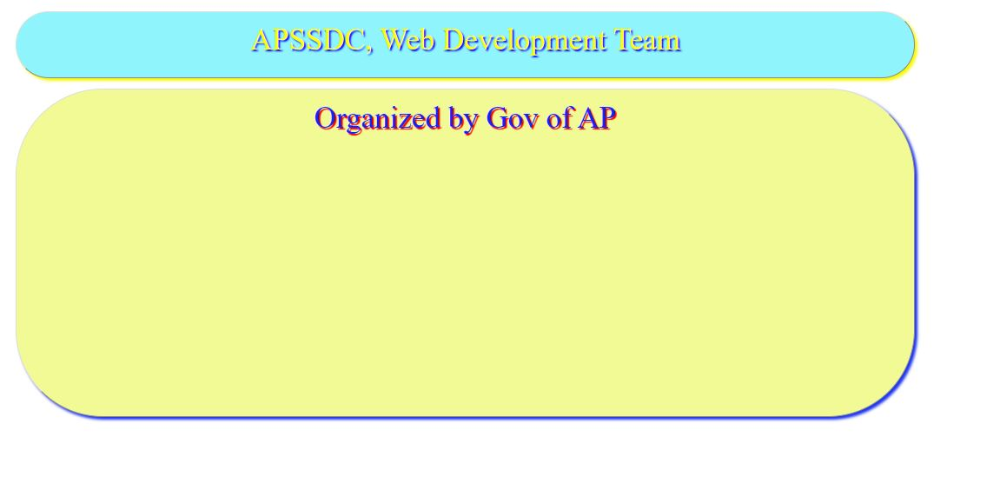

# FrontEnd-Documentation

____
## WebDevelopment-Document-HTML5

### TOPICS
----
#### Basic Content and Tags of HTML
#### Basic Tags
#### Various tags exist in HTML
#### Block Level Elements
#### Inline Elements
#### Semantic Elements
#### Forms in HTML
#### Form Controls
#### Placeholders,id,name,required Properties
#### Form Methods
----

##### Why Learn HTML?
HTML is the foundation of all web pages. Without HTML, you wouldn’t be able to organize text or add images or videos to your web pages. HTML is the beginning of everything you need to know to create engaging web pages!.We can create a static website by HTML only.

HTML is a **markup language** i.e., it is a way for the computers to communicate with each other, to control how text is processed and presented. A website will be opened on various systems with different browsers and the markup language ensures that the website looks the same in all the systems by the help of its various tags. The latest is the HTML5 and now it has a lot of features which are widely used to format web pages.

HTML stands for **Hypertext Markup Language** Let's understand each word-

**Hypertext:** Hypertext is a text that has a link within it, clicking on which will bring the user to a new page. Apart from text, hypertext may contain tables, lists, forms, images, etc.

**Markup language:** A Markup language is the one that uses tags to define elements within a document. It contain standard words which are human readable like forms, tables, link, title and so on. Every tag in a markup language has a special meaning of its own and performs a particular operation.

#### Here is what you can do with HTML-

* Create structure of Web Page or Website.
* It has tags which can help you to optimize the website, to boost the performance and give good results.
* It is the base of designing and developing web pages, once you understand the basic of HTML then other related technologies like     	Javascript, CSS, etc become easier to understand.
* HTML pages are platform independent and they work on mobile, tabs, desktop, etc.
* You can create offline pages which can load even with no internet.
* HTML 5 can give support in enhancing the experience in gaming arena.
* Every known browser available today, supports HTML.

#### Applications of HTML

**Web pages development** - HTML is used to create pages which are rendered over the web. Almost every page of web is having html tags in it to render its details in browser.

**Internet Navigation** - HTML provides tags which are used to navigate from one page to another and is heavily used in internet navigation.

**Responsive UI** - HTML pages now-a-days works well on all platform, mobile, tabs, desktop or laptops owing to responsive design strategy.

**Offline support** - HTML pages once loaded can be made available offline on the machine without any need of internet.

**Game development** - HTML5 has native support for rich experience and is now useful in gaming developent arena as well.


#### Software Requirement:( In following Softwares we need any one required )
* [Notepad](https://www.google.com/)
* [Notepad++](https://notepad-plus-plus.org/downloads/)
* [Edit-Plus](https://www.editplus.com/download.html)
* [HTML-Kit](http://www.htmlkit.com/)
* [Sublime](https://www.sublimetext.com/3)
* [Bluefish](http://bluefish.openoffice.nl/index.html)
* [CoffeeCup](https://www.coffeecup.com/)

**Download Required Software by Click on Above Names**  or **You can Use online Editor**[ --> Online-Editor](https://www.coderepublics.com/tryit/tryit.php?name=html-examples/html-basic-example.php)

**Rules of HTML**
* Save the file with **.html** extension Example:- registerpage.html
* Use inbuilt tags only
* For Paired Tags You must close with respective closing tag

#### Basic Structure Of HTML

```html
<!DOCTYPE html>
<html>
<head>
	<title></title>
</head>
<body>
<!-- Write your code here -->
</body>
</html> 
```

#### Explanation

```html
<!DOCTYPE>: It defines the document type of HTML version.
<html>: It is the root element that describes the web document. It is a paired tag, i.e., it has a closing tag also, </html>. Everything will be written inside these tags.
<head>: It contains informations about the document like its title, author information, description of the website, etc. It has different tags to perform these functions. It is also a paired tag.
<title>: It is used inside <head> and it specifies the title of the document.
<body>: It contains all the information which will be displayed in the webpage. If you want anything to be displayed on the webpage you have to write it within this tag.
```

### HTML Tags
Every HTML tag has a special meaning to the browser. Each tag performs its own function and helps in creating the proper structure of a web page. You can't create ur own tags, all tags are predefined.

Syntax:
```html
<tag> Content </tag>
```

#### Types of Tags
* Paired Tags
* Unpaired Tags

##### Paired Tags
Paired tags are those tags that comes in pair. They have an opening and a closing tag.

Syntax: 
```html 
<tag> Content </tag>
```
###### Some Paired Tags are:
```html 
 <html> </html>
 <table> </table>
 <form> </form>
 <span> </span>
 <p> </p>
```
##### Unpaired Tags
Unpaired tags do not have a closing tag. These are opened same as paired tags but do not have to be closed.

##### Some Unpaired Tags are:
```html
<!DOCTYPE>
<br>
<hr>
<meta>
<input>
```
### Basic HTML Tags

##### Block level elements:
* H1,h2,...,h6
* Div
* P
* Semantic elements

##### Semantic Elements
* Header
* Section
* Article
* Aside
* Footer
* Nav
* Main

##### Inline elements :
* Span
* Img
* Form controls (iput, select, button, submit)
* Navigation (a, href)
* In bound (With in the page)
* Outer bound (between pages)
* Mail to (Email address)
* Tel (Phone number)

#### HTML Heading Tag
Heading tag is used to give headings of particular sizes in a document. There are six different HTML heading tags, which gives different heading sizes and are defined by ```html <h1> to <h6> tags. <h1> gives the largest heading and <h6> gives the smallest one. So <h1> can be used for most important headings and <h6>``` can be used for least important one.
  
##### Example for Heading Tags 

```html
<!DOCTYPE html>
<html lang="en"> 
<!-- lang indicates language 
en indicates english
-->
<head>
	<title>Heading Tags Example </title>
</head>
<body>
	<h1>Heading size1</h1>
	<h2>Heading size2</h2>
	<h3>Heading size3</h3>
	<h4>Heading size4</h4>
	<h5>Heading size5</h5>
	<h6>Heading size6</h6>
</body>
</html>
```
###### Output


##### HTML Paragraph Tag
The ```html <p> tag is used to define a paragraph in a document. HTML paragraph or HTML <p>``` tag gives the text inside it, a paragraph like finishing. It is a notable point that a browser itself add an empty line before and after a paragraph.

##### Example for Paragraph Tag
```html
<!DOCTYPE html>
<html>
<head>
	<title>Paragraph Example </title>
</head>
<body>
	<p> This is used for writing paragraph.This tag tag gives the text inside it, a paragraph like finishing. It is a notable point that a browser itself add an empty line before and after a paragraph. </p>
</body>
</html>
```
##### Output


##### div Tag
The ```html <div> tag defines a division or a section in an HTML document.
The <div> tag is used as a container for HTML elements - which is then styled with CSS or manipulated with JavaScript.
The <div> tag is easily styled by using the class or id attribute.
Any sort of content can be put inside the <div> tag! 
Note: By default, browsers always place a line break before and after the <div>``` element.

##### Example
```html
<html>
<head>
	<h4>Div tag Example</h4>
</head>
<body>

<div>
  <h2>This is a heading in a div element</h2>
  <p>This is some text in a div element.</p>
</div>

</body>
</html>
```
#### Semantic elements:

##### header
The  header element represents a container for introductory content or a set of navigational links.
A header element typically contains:
* one or more heading elements ```html <h1> - <h6>```
* logo or icon
* authorship information
Note: You can have several ```html <header> elements in one HTML document. However, <header> cannot be placed within a <footer>, <address> or another <header>``` element.

##### section

The ```html <section> tag defines sections in a document, such as chapters, headers, footers, or any other sections of the document.
The  <section> tag also supports the Global Attributes in HTML.
The  <section> ``` tag also supports the Event Attributes in HTML.

##### Example

```html
<!DOCTYPE html>
<html>
<body>

<h1>The section element</h1>

<section>
  <h2>WWF</h2>
  <p>The World Wide Fund for Nature (WWF) is an international organization working on issues regarding the conservation, research and restoration of the environment, formerly named the World Wildlife Fund. WWF was founded in 1961.</p>
</section>

<section>
  <h2>WWF's Panda symbol</h2>
  <p>The Panda has become the symbol of WWF. The well-known panda logo of WWF originated from a panda named Chi Chi that was transferred from the Beijing Zoo to the London Zoo in the same year of the establishment of WWF.</p>
</section>

</body>
</html>
```
##### HTML Article
The HTML ```html <article>``` tag defines an independent self-contained content in a document. It usually works like a normal div, but is given special name and used as an area where specifically articles should be written.

This tag is usually used on blog post, Forum post, comments etc.

##### Example
```html
<!DOCTYPE html>
<html lang="en">
<head>
  <title> HTML Article Tag </title>
</head>
<body>
<article>  
<h2>Linux OS</h2>
<i>(Operating System) </i>
<p>Linux is a free open-source Operating System, built around the Linux Kernel.
Linus Torvalds is the Father of Linux.</p>  
</article>
</body>
</html>
```
##### aside Tag:

The ```html <aside>``` tag defines some content aside from the content it is placed in.
The aside content should be indirectly related to the surrounding content.
Tip: The ```html<aside> content is often placed as a sidebar in a document.

Note: The <aside> element does not render as anything special in a browser. However, you can use CSS to style the <aside>``` element (see example below).

##### Example:

```html
<!DOCTYPE html>
<html>
<body>

<h1>The aside element</h1>

<p>My family and I visited The Epcot center this summer. The weather was nice, and Epcot was amazing! I had a great summer together with my family!</p>

<aside>
  <h4>Epcot Center</h4>
  <p>Epcot is a theme park at Walt Disney World Resort featuring exciting attractions, international pavilions, award-winning fireworks and seasonal special events.</p>
</aside>

</body>
</html>
```

##### HTML Footer Tag
The HTML ```html <footer> ``` tag was introduced in HTML 5. It is used to define a footer for a document or a section. It is specifically used for defining footer at the bottom of the webpage.

##### A Footer element contains:

* Copyright information
* Contact information
* Related documents
* Back to top links
* Sitemap

##### Example

```html
<!DOCTYPE html>
<html lang="en">
<head>
  <title> HTML Footer Tag </title>
</head>
<body>
<footer>
  <p>Posted by: Bill Gates</p>
  <p>Contact information: <a href="mailto:someone@example.com">someone@example.com</a>.</p>
</footer>
</body>
</html>
```
###### nav Tag:

The ```html <nav> ``` tag defines a set of navigation links.
Notice that NOT all links of a document should be inside a <nav> element. The <nav> element is intended only for major block of navigation links.
Browsers, such as screen readers for disabled users, can use this element to determine whether to omit the initial rendering of this content.

##### Example
```html
<!DOCTYPE html>
<html>
<body>

<h1>The nav element</h1>

<p>The nav element defines a set of navigation links:</p>

<nav>
<a href="https://www.google.com/">Google</a> |
<a href="https://www.google.com/intl/en-GB/gmail/about/#/">G-Mail</a> |
<a href="https://www.w3schools.com/html/default.asp">HTML</a> |
<a href="https://www.w3schools.com/python/default.asp">Python</a>
</nav>

</body>
</html>
```
##### main Tag:

The ```html <main>``` tag specifies the main content of a document.

The content inside the ```html <main>``` element should be unique to the document. It should not contain any content that is repeated across documents such as sidebars, navigation links, copyright information, site logos, and search forms.

Note: There must not be more than one ```html <main> element in a document. The <main> element must NOT be a descendant of an <article>, <aside>, <footer>, <header>, or <nav>``` element.

##### Example
```html
<!DOCTYPE html>
<html>
<body>

<h1>The main element</h1>

<main>
  <h2>Web Browsers</h2>
  <p>Chrome, Firefox, and Edge are the most used browsers today.</p>

  <article>
    <h3>Google Chrome</h3>
    <p>Chrome is a free, open-source web browser developed by Google, released in 2008.</p>
  </article>

  <article>
    <h3>Microsoft Edge</h3>
    <p>Edge is a free web browser from Microsoft, released in 1995.</p>
  </article>

  <article>
    <h3>Mozilla Firefox</h3>
    <p>Firefox is a free, open-source web browser from Mozilla, released in 2004.</p>
  </article>
</main>

<p><strong>Note:</strong> The main tag is not supported in Internet Explorer 11 and earlier versions.</p>

</body>
</html>
```

##### span Tag:

The ```html <span>``` tag is an inline container used to mark up a part of a text, or a part of a document.

The ```html <span>``` tag provides no visual change by itself, but when it is marked, you can style it with CSS, or manipulate it with JavaScript.

```html
<!DOCTYPE html>
<html>
<body>

<h1>The span element</h1>

<p>My mother has <span style="color:blue;font-weight:bold">blue</span> eyes and my father has <span style="color:darkolivegreen;font-weight:bold">dark green</span> eyes.</p>

</body>
</html>
```

#### Navigation(a,href)

###### inbound 
A navigation bar needs standard HTML as a base.

In our examples we will build the navigation bar from a standard HTML list.
There are two ways to create a horizontal navigation bar. Using inline or floating list items.
A navigation bar is basically a list of links, so using the <ul> and <li> elements makes perfect sense:
	
```html
<!DOCTYPE html>
<html>
<body>

<ul>
  <li><a href="#home">Home</a></li>
  <li><a href="#news">News</a></li>
  <li><a href="#contact">Contact</a></li>
  <li><a href="#about">About</a></li>
</ul>

<p>Note: We use href="#" for test links. In a real web site this would be URLs.</p>

</body>
</html>
```

###### outer bound


#### HTML Anchor Tag

HTML link is defined with the ```html <a>``` tag (Anchor tag). It is used to give link to any other file, webpage, image etc.

This tag is called anchor tag and anything between the opening ```html <a> tag and the closing </a> ``` tag becomes part of the link and a user can click that part to reach to the linked document.

##### Example on Anchor Tag

```html
<!DOCTYPE html>
<html>
<head>
	<title>Anchor tag Example page </title>
</head>
<body>
	<a href="https://www.google.com/">Click here to goto Google page </a>
</body>
</html>
```
##### Output


#### HTML Image Tag
The Image Tag is used to add Images in HTML documents. The HTML ```html  ``` tag is used to add image in a document.The 'src' attribute is used to give source(address) of the image. The height and width of the image can be controlled by the attributes - height="px" and width="px". The 'alt' attribute is used as an alternative in a case if the image is not shown.

##### Example On Image Tag

```html
<!DOCTYPE html>
<html>
<head>
	<title>Image Tag Page </title>
</head>
<body>
	
</body>
</html>
```
#### HTML Formatting Tags
HTML Formatting is a process of changing appearance of text for better look and feel than the default text. The formatting tags are used to make text bold, italic, underlined, etc. There are almost 12 options available that how text appears in HTML.

##### Some tags are:
```html
Bold Text -- <b>
Italic Text -- <i>
Underlined Text -- <u>
Important Text -- <strong>
Small Text -- <small>
Big Text -- <big>
Mark Text -- <mark>
Emphasized Text -- <em>
Deleted Text -- <del>
Inserted Text -- <ins>
Subscripted Text -- <sub>
Superscripted Text -- <sup>
```
##### Output


#### HTML Table
An HTML table is defined with the ```html <table> ``` tag. A table is used to display data in tabular form (rows * column). It is a paired tag. Just use these tags with their attributes to create tables. You can also use CSS stylesheet to beautify these structures. A table structure is represented in ‘rows*columns’ form, i.e. a ‘4*5’ table represents a table with 4 rows and 5 columns.

Tables are also used in websites to present any data to the user. It looks really neat and also everyone prefers tabular form of data nowadays. The HTML tables allows to arrange data like text, images, etc. into rows and columns.

##### Tags of Table:

```html
<table></table> <!-- Table Main Tag -->
	<thead></thead> <!--Table Header tags -->
	<tr></tr> <!-- Table row Tag -->
	<th></th> <!--Table Heafer Name Tag -->
	<tbody></tbody> <!-- Table Tag -->
	<td></td> <!-- Table Data Tag -->
```
##### Example On Table

```html
<!DOCTYPE html>
<html>
<head>
	<title>Sample Table Example </title>
</head>
<body>
	<table>
		<thead>
			<tr>
				<th>Header_Name1</th>
				<th>Header_Name2</th>
			</tr>
		</thead>
		<tbody>
			<tr>
				<td>Row1_Value1</td>
				<td>Row1_value2</td>
			</tr>
			<tr>
				<td>Row2_value1</td>
				<td>Row2_value2</td>
			</tr>
		</tbody>
	</table>
</body>
</html>
```

##### Output


**imp: You can Apply CSS for tables based on your Requirement**

##### Example2

```html
<!DOCTYPE html>
<html>
<head>
	<title>Table Example </title>
</head>
<body>
	<table>
		<thead>
			<tr>
				<th> Name </th>
				<th>Salary</th>
			</tr>
		</thead>
		<tbody>
			<tr>
				<td>Hari</td>
				<td>25000</td>
			</tr>
			<tr>
				<td>Krishna</td>
				<td>36000</td>
			</tr>
		</tbody>
	</table>
</body>
</html>
```
##### Output


##### Example
```html
<!DOCTYPE html>
<html lang="en">
<head>
  <title> HTML Table Border Attribute </title>
 </head>
<body> 
<table border="1" width="40%"> <!-- Here applied border and width of the table -->
<tr> 
    <th> Name </th> 
    <th> Salary </th> 
    <th> Age </th> 
</tr> 
<tr> 
    <td> Anshuman </td> 
    <td> Rs. 2,00,000 </td> 
    <td> 25 </td> 
</tr> 
<tr> 
    <td> Kuldeep </td>
     <td> Rs. 5,00,000 </td> 
    <td> 22 </td> 
</tr> 
</table>
</body>
</html>
```

##### Output


##### You can Apply 
* The 'Cellpadding' and 'Cellspacing' Attribute
* These "cellpadding" and "Cellspacing" attributes are used to adjust the white spaces in your table cells.
* colspan,Rowspan attributes

##### HTML Font Size
We can set font size using size attribute.
* The range of accepted values is from 1 to 7.
* The default size of a font is 3.

##### Example
```html
<!DOCTYPE html>
<html lang="en">
<head>
  <title> HTML Font Size </title>
</head>
<body>
<font size="1">Hello HTML 5!</font>
<font size="2">Hello HTML 5!</font>
<font size="3">Hello HTML 5!</font>
<font size="4">Hello HTML 5!</font>
<font size="5">Hello HTML 5!</font>
<font size="6">Hello HTML 5!</font>
<font size="7">Hello HTML 5!</font>
</body>
</html>
```

##### Font Face
You can set font face using face attribute but be aware that if the user viewing the page doesn't have the font installed, they will not be able to see it. Instead user will see the default font style.

##### Example

```html
<!DOCTYPE html>
<html lang="en">
<head>
  <title>HTML Font Face Attribute </title>
</head>
<body>
<font face="Times New Roman" size="5">Times New Roman</font><br>
<font face="Verdana" size="5">Verdana</font><br>
<font face="Comic sans MS" size="5">Comic Sans MS</font><br>
<font face="WildWest" size="5">WildWest</font><br>
<font face="Bedrock" size="5">Bedrock</font><br>
</body>
</html>
```
##### Output


#### Ordered List in HTML
This list is created by using ```html <ol> ``` tag. Any series can be used to order the elements, like series of digits, alphabets, roman numerals, etc. All these series gets increased by one with every new element entered in the list.

Ex.-For a numbered order list, the numbering starts at one and is incremented by one for each successive ordered list element tagged with ```html <li>```.

##### Example

```html
<!DOCTYPE html>
<html>
<head>
	<title>Order List</title>
</head>
<body>
	<h4>This is Order List </h4>
  <ol> <!-- Here you can mention starting value Ex:<ol start="100"> </ol> -->
		<li>First</li>
		<li>Second</li>
		<li>Third</li>
	</ol>
</body>
</html>
```
##### Output


##### Ordered list Type Attribute
The type attribute is used to change the series type.
* type="1"	The list items will be numbered with numbers (default).
* type="A"	The list items will be numbered with uppercase letters.
* type="a"	The list items will be numbered with lowercase letters.
* type="I"	The list items will be numbered with uppercase roman numbers.
* type="i"	The list items will be numbered with lowercase roman numbers.

##### Example:

```html
<!DOCTYPE html>
<html>
<head>
	<title>Order List</title>
</head>
<body>
	<h4>This is Order List </h4>
	<ol type="A"> 
		<li>First</li>
		<li>Second</li>
		<li>Third</li>
	</ol>
</body>
</html>
```

##### Output


##### Unordered List:
An unordered list is a collection of related items that are listed with no special order or sequence. This list is created by using HTML ```html <ul> tag. Each item in the list is marked with a bullet. Each item starts with <li>``` tag.

##### Example:
```html
<!DOCTYPE html>
<html>
<head>
	<title>Unordered List Example </title>
</head>
<body>
	<h4>Unordered List Example </h4>
	<ul>
		<li>Line1</li>
		<li>Line2</li>
		<li>Line3</li>
	</ul>
</body>
</html>
```
##### Output


##### Unorder List Type Attribute
**The type attribute is used to change the series type.**
* type="disc"	Sets the list item marker to a bullet (default).
* type="circle"	Sets the list item marker to a circle.
* type="square"	Sets the list item marker to a square.
* type="none"	The list items will not be marked.

##### Example
```html
<!DOCTYPE html>
<html>
<head>
	<title>Unordered List Example </title>
</head>
<body>
	<h4>Unordered List Example </h4>
	<ul type="square">
		<li>Line1</li>
		<li>Line2</li>
		<li>Line3</li>
	</ul>
</body>
</html>
```

##### Output


#### HTML form Tag:
An HTML form is a section of a document which contains different fields like **text fields, password fields, checkboxes, radio buttons, submit button, menus** etc.

HTML Forms can be used where we want to collect some data from the site visitor. For example, in case of user registration you would like to collect information such as **name, email address, Phone number,** etc.

##### HTML Forms Elements

```html
* <form>	It defines an HTML form to enter inputs by the used side.
* <input>	It defines an input control.
* <select>	It defines a multi-line input control.
* <option>	It defines an option in a drop-down list.
* <textarea>	It defines a drop-down list.
* <button>	It defines a label for an input element.
* <fieldset>	It groups the related element in a form.
* <legend>	It defines a caption for a <fieldset> element.
* <optgroup>	It defines a group of related options in a drop-down list.
* <label>	It defines a label for a field.
  ```

##### HTML Form Structure
The HTML ```html <form> tag defines a form that is used to collect user input. All the form elements should be written inside <form> and </form>```  tags.

Syntax:
```html
<form>
	........
	
	Form Elements
	........
</form>
```
#### HTML Form Elements
##### 'Input' Element:
The most important form element is the ```html <input> element. The <input>``` element can be displayed in several ways, depending on the type attribute.
Syntax: ```html <input type="value">```

##### HTML```html <input>``` type Attribute:

Attribute_Values --> Value_Description
* **button** --> Defines a clickable button (mostly used with a JavaScript to activate a script)
* **checkbox** --> Defines a checkbox
* **color** --> Defines a color picker
* **date** --> Defines a date control (year, month, day (no time))
* **datetime-local** --> Defines a date and time control (year, month, day, time (no timezone)
* **email** --> Defines a field for an e-mail address
* **file** --> Defines a file-select field and a "Browse" button (for file uploads)
* **hidden** --> Defines a hidden input field
* **image** -->	Defines an image as the submit button
* **month** --> Defines a month and year control (no timezone)
* **number** --> Defines a field for entering a number
* **password** --> Defines a password field
* **radio** --> Defines a radio button
* **range** --> Defines a range control (like a slider control)
* **reset** --> Defines a reset button
* **search** --> Defines a text field for entering a search string
* **submit** --> Defines a submit button
* **tel** --> Defines a field for entering a telephone number
* **text** --> Default. Defines a single-line text field
* **time** --> Defines a control for entering a time (no timezone)
* **url** -->	Defines a field for entering a URL
* **week** --> Defines a week and year control (no timezone)

##### HTML Input Type
Here is a list of some common HTML Form input types.

Type	Description
* **text:**	It defines a one-line text input field.
* **password:**	Defines a one-line password input field.
* **submit:**	It specifies a submit button to submit the form to server.
* **reset:**	The reset button reset all values in the form.
* **radio:**	A Radio button allows select one option.
* **checkbox:**	Checkboxes allow selecting multiple options form.
* **button:**	Defines a clickable button, which can perform a task on an event.
* **file:**	It defines to select the file from device storage.
* **image:**	It Defines a graphical submit button.

##### Example1:
```html
<!DOCTYPE html>
<html>
<head>
	<title>Input Tag Example</title>
</head>
<body>
	User Name: <input type="text" name="username">
</body>
</html>
```
##### Output:


##### Example2:

```html
<!DOCTYPE html>
<html>
<head>
	<title>Input Tag Example</title>
</head>
<body>
	User Name: <input type="text" name="username"><br>
	<input type="submit" name="submit" value="Click Here"><br>
	<input type="submit" name="button" value="cancel">
</body>
</html>
```
##### Output:


##### Example3:
```html
<!DOCTYPE html>
<html>
<head>
	<title>Input Tag Example</title>
</head>
<body>
	User Name: <input type="text" name="username"><br>
	Birthday:<input type="date" id="birthday" name="birthday"><br><br>
	<input type="submit" name="submit"><br>
	<input type="button" name="button" value="cancel">
</body>
</html>
```
##### Output:


##### Checkbox & Radiobutton:
##### Example:
```html
<!DOCTYPE html>
<html lang="en">
<head>
    <title> HTML Form Input Type Radio Button & Checkbox </title>
</head>
<body>
<form>
	 <!-- Radio Button input type -->
  <h4>This is Radio Button Example </h4>
  <input type="radio" name="gender" value="male" checked> Male<br>
  <input type="radio" name="gender" value="female"> Female<br>
  <input type="radio" name="gender" value="other"> Other<br><br>
  <input type="submit">
  <br> <br> <br> <!-- This is for new line access purpose -->
   <!-- Checkbox input type -->
  <h4>This is checkbox Example </h4>
  <input type="checkbox" name="vehicle1" value="Bike">Samsung
  <input type="checkbox" name="vehicle2" value="Car">Google Pixel<br><br>
  <input type="submit">
</form> 
</body>
</html>
```

##### Output:


##### Example:
```html
<!DOCTYPE html>
<html>
<head>
	<title>Input Attribute Values </title>
</head>
<body>
	<form>
		Enter Mail: <input type="email" id="email" name="email"><br><br>
		Enter mobile Number: <input type="tel" id="phone" name="phone" pattern="[0-9]{3}-[0-9]{2}-[0-9]{3}"><br><br>
		Enter Date & Time: <input type="datetime-local" id="birthdaytime" name="birthdaytime"><br><br>
		Enter Time: <input type="time" id="appt" name="appt"><br><br>
		Enter Number: <input type="number" id="quantity" name="quantity" min="1" max="5"><br><br>
		Enter Password: <input type="password" id="pwd" name="pwd"><br><br>
	</form>
</body>
</html>
```
##### Output:


##### Example:
```html
<!DOCTYPE html>
<html>
<head>
	<title>Input Attribute Values </title>
</head>
<body>
	<form>
		Select Range: <input type="range" id="vol" name="vol" min="0" max="50"><br><br>
		Enter url: <input type="url" id="homepage" name="homepage"><br><br>
		Choose File: <input type="file" id="myfile" name="myfile"><br><br>
		Select Image: <input type="image" src="https://github.com/SIVARANGA/WebDevelopment-Document-HTML5/blob/master/cat.jpg?				raw=true" alt="Problem with image" width="48" height="48"><br><br>
		Select Color:<input type="color" id="favcolor" name="favcolor" value="#ff0000"><br><br>
		Search Here: <input type="search" id="gsearch" name="gsearch"><br><br>
	</form>
</body>
</html>
```

##### Output:
```html
<!DOCTYPE html>
<html>
<head>
	<title>Input Attribute Values </title>
</head>
<body>
	<form>
		Select Range: <input type="range" id="vol" name="vol" min="0" max="50"><br><br>
		Enter url: <input type="url" id="homepage" name="homepage"><br><br>
		Choose File: <input type="file" id="myfile" name="myfile"><br><br>
		Select Image: <input type="image" src="https://github.com/SIVARANGA/WebDevelopment-Document-HTML5/blob/master/cat.jpg?				raw=true" alt="Problem with image" width="48" height="48"><br><br>
		Select Color:<input type="color" id="favcolor" name="favcolor" value="#ff0000"><br><br>
		Search Here: <input type="search" id="gsearch" name="gsearch"><br><br>
	</form>
</body>
</html>
```
##### Otput:


##### Select Element
The ```html <select>``` element defines a drop-down list. It mostly used when you have to show numbers of items.

##### Example
```html
<!DOCTYPE html>
<html lang="en">
<head>
    <title> HTML Form Select Attribute </title>
</head>
<body>
<form>
 <select name="Cars">
 	<option value="select"> select </option>
    <option value="Audi"> Audi </option>
    <option value="Mercedes"> Mercedes </option>
    <option value="Lamborghini"> Lamborghini </option>
 </select>
  <input type="submit">
</form>
</body>
</html>
```
##### Output


##### Textarea Element
The ```html <textarea>``` element defines a multi-line input field.

##### Example
```html
<!DOCTYPE html>
<html lang="en">
<head>
    <title> HTML Form Textarea Attribute </title>
</head>
<body>
<h2>Textarea</h2>
<p>The textarea element defines a multi-line input field.</p>
<form action="action-page.php">
  <textarea name="message" rows="5" cols="60"> This is a simple Example of Textarea. </textarea>
  <br>
  <input type="submit">
</form>
</body>
</html>
```
##### Output:


##### Button Element
The ```html <button>``` element defines a clickable button.

##### Example
```html
<!DOCTYPE html>
<html lang="en">
<head>
    <title> HTML Form Button Attribute </title>
</head>
<body>
	<button type="button" onclick="alert('Hello World..!')">Click Me!</button>
</body>
</html>
```
##### Output


##### Method' Attribute
The method attribute specifies the HTTP method (GET or POST) to be used when submitting the form data.
The GET is the default method when you submitting your form data.

Syntax
```html
<form action="action-page.php" method="get">
<form action="action-page.php" method="post">
```

##### Name Attribute
The name attribute specifies the name of ```html <input>``` element. It is a good practice to use this attribute, and also good for SEO purpose.
##### Example
```html
<!DOCTYPE html>
<html lang="en">
<head>
    <title> HTML Form Name Attribute </title>
</head>
<body>
<form>
  First name:
  <input type="text" value="John"><br>
  Last name:
  <input type="text" name="lastname" value="Snow"><br>
  <input type="submit" value="Submit">
</form> 
</body>
</html>
```
##### Output


##### Grouping Form Data with ```html <fieldset>
The <fieldset> element is used to group related data in a form and the <legend> element defines a caption for the <fieldset>``` element.
	
##### Example
```html

<!DOCTYPE html>
<html lang="en">
<head>
    <title> HTML Form Fieldset and Legend Attributes </title>
</head>
<body>
<form action="action-page.php">
  <fieldset>
    <legend>Personal information:</legend>
    First name:
    <input type="text" name="firstname" value="John">
    Last name:
    <input type="text" name="lastname" value="Snow">
    <input type="submit" value="Submit">
  </fieldset>
</form>
</body>
</html>
```


##### placeholder	
It gives a hint about the value to be entered in the ```html <input> ```element.
##### required	
It specifies that an input field must be filled out before submitting the form.
##### step	
It specifies the legal number intervals for an ```html <input>``` element.

##### HTML Break
The HTML ```html <br> tag or element breaks line in a paragraph. The <br>``` tag is an Unpaired tag which means that it has no end tag.

#### Form Method Attributes:

The method attribute specifies how to send form-data (the form-data is sent to the page specified in the action attribute).

The form-data can be sent as URL variables (with method="get") or as HTTP post transaction (with method="post").

##### Notes on GET:

* Appends form-data into the URL in name/value pairs
* The length of a URL is limited (about 3000 characters)
* Never use GET to send sensitive data! (will be visible in the URL)
* Useful for form submissions where a user wants to bookmark the result
* GET is better for non-secure data, like query strings in Google

##### Notes on POST:

* Appends form-data inside the body of the HTTP request (data is not shown in URL)
* Has no size limitations
* Form submissions with POST cannot be bookmarked

##### Attribute Values
Value --> Description
get  --> Default. Appends the form-data to the URL in name/value pairs: URL?name=value&name=value
post --> Sends the form-data as an HTTP post transaction

##### id,required
###### id
The HTML id attribute is used to specify a unique id for an HTML element (the value must be unique within the HTML document).
The id attribute is used by CSS or JavaScript to perform certain tasks for the element with the specific id value.

In CSS, to select an element with a specific id, write a hash (#) character, followed by the id of the element.

Tip: The id attribute can be used on any HTML element.
Note: The id value is case-sensitive.
Note: The id value must contain at least one character, and must not contain whitespace (spaces, tabs, etc.).

##### required
The required attribute is a boolean attribute.
When present, it specifies that an input field must be filled out before submitting the form.
Note: The required attribute works with the following input types: text, search, url, tel, email, password, date pickers, number, checkbox, radio, and file.

Syntax:
```html<input required>```

____

## CSS_Documentation

### What is CSS?
**CSS** stands for Cascading Style Sheets. Which is used to describe the look and formatting of a document written in markup language, **CSS** allows you to apply styles to web pages.

### CSS Syntax
A **CSS** rule set contains a selector and a declaration block.
___


* **Selector:** Selector indicates the HTML element you want to style. 
* **DeclarationBlock:** The declaration block can contain one or more declarations separated by a semicolon.
* **Property:** A Property is a type of attribute of HTML element. It could be color, border etc.
* **Value:** Values are assigned to CSS properties. In the above example, value "yellow" is assigned to color property.

### CSS Selectors

* **CSS selectors** are used to select the content you want to style. 
* **CSS selectors** select HTML elements according to its **id, class, type, attribute** etc.


There are several different types of selectors in CSS.

1. **CSS Element Selector**
1. **CSS Id Selector**
1. **CSS Class Selector**
1. **CSS Universal Selector**
1. **CSS Group Selector**

#### 1. CSS Element Selector

* The element selector selects the HTML element by name.

```
<!DOCTYPE html>  
<html>  
<head>  
<style>  
p{  
    text-align: center;  
    color: green;
    font-size: 35px;
    background: #F3B9FB;
}   
</style>  
</head>  
<body>  
<p>Welcome to APSSDC</p>  
<p id="para1">Gov of Andhra Pradesh</p>  
<p>Vijayawada!</p>  
</body>  
</html> 
```
#### Output:
____


#### 2. CSS Id Selector

The **id selector** selects the id attribute of an HTML element to select a specific element. And it is chosen to select a single, **unique** element.

* It is written with the hash character (#)
```
<!DOCTYPE html>  
<html>  
<head>  
<style>  
#para1 {  
    text-align: center;  
    color: red;
    font-size: 40px;
}
#colors{
	background: #F3CF80;
}
</style>  
</head>  
<body id='colors'>  
<p id="para1">Hello EveryOne..!</p>  
<p>Welcome to Frontend CSS Class.</p>  
</body>  
</html>
```
### Output:
___


#### 3.CSS Class Selector

The class selector selects HTML elements with a specific class attribute. It is used with a period character . (full stop symbol) followed by the class name.

**Note:A class name should not be started with a number.**
```
<!DOCTYPE html>  
<html>  
<head>  
<style>  
.center {  
    text-align: center;  
    color: orange;
    font-size: 35px;
    font-style: bold;

}  
</style>  
</head>  
<body>  
<h1 class="center">Andhra Pradesh State Skill Development Corporation</h1>  
<p class="center">Gov of Andhra Pradesh</p>   
</body>  
</html>  
```
#### Output:
___


#### 4.CSS Universal Selector

The universal selector is used as a wildcard character. It selects all the elements on the pages.

```
<!DOCTYPE html>  
<html>  
<head>  
<style>  
* {  
    text-align: left;  
    color: blue;
    font-size: 35px;
    font-style: bold;
    background: #FB7D3A ;

}  
</style>  
</head>  
<body>  
<h1 class="center">Andhra Pradesh State Skill Development Corporation</h1>  
<p class="center">Gov of Andhra Pradesh</p>   
</body>  
</html>
```
#### Output:
___


#### 5. CSS Group Selector

The grouping selector is used to select all the elements with the same style definitions.

* Grouping selector is used to minimize the code. 
* Commas are used to separate each selector in grouping

```
h1 {  
   text-align: center;  
    color: blue;
    font-style: bold;
    background: #AAFA54;
     
}  
h2 {  
   text-align: center;  
    color: blue;
    font-style: bold;
    background: #AAFA54;
}  
p {  
   text-align: center;  
    color: blue;
    font-style: bold;
    background: #AAFA54;
} 
``` 
**Example Program**
```
<!DOCTYPE html>  
<html>  
<head>  
<style>  
h1, h2, p,body {  
    text-align: center;  
    color: blue;
    font-style: bold;
    background: #AAFA54;
}  
</style>  
</head>  
<body>  
<h1>Hello EveryOne</h1>  
<h2>Welcome to CSS Class</h2>  
<p>This Program is offerd by the gov of Andhra Pradesh</p>  
</body>  
</html>
```

#### Output:
___


### Kinds of CSS

There are three ways to insert CSS in HTML documents.

* Inline CSS
* Internal CSS (or) Embedded CSS
* External CSS

#### 1. Inline CSS

**Inline CSS** is used to apply **CSS** on a single line or element.

**Example:**

```
<body style="background: #F3FF62 ">
<p style = "color:red; font-size:40px; 
            font-style:italic; text-align:center;"> 
            APSSDC, Vijayawada
        </p> 
```
**Example Program**
```
<!DOCTYPE html> 
<html> 
    <head> 
        <title>Inline CSS</title> 
    </head> 
      
    <body style="background: #F3FF62 "> 
    <h1 >Web Development</h1> 
    <p style = "color:red; font-size:40px; 
            font-style:italic; text-align:center;"> 
            APSSDC, Vijayawada
        </p>  
    </body> 
</html>     
```
#### Output:
___


#### 2.Internal CSS (or) Embedded CSS

The internal style sheet is used to add a unique style for a single document. It is defined in **head** section of the HTML page inside the **style** tag.

**Example**

```
<!DOCTYPE html>
<html>
<head>
	<style>
			body {
			  background-color: linen;
			}

			h1 {
			  color: red;
			  margin-left: 40px;
			}
			#vis{
			  color: green;
			  text-align: center;
			  font-size:40px;

			}

	</style>
</head>
<body>

	<h1>Andhra Pradesh State Skill Development Corporation</h1>
	<h2 id='vis'>Gov of Andhra Padesh</h2>
	<p>APSSDC, Vijayawada</p>


</body>
</html>
```

#### Output:
___


#### External CSS

**External CSS:** External CSS contains separate CSS file which contains only style property with the help of tag attributes (For example class, id, heading, … etc). 

* The external .css file should not contain any HTML tags.


**Example:**

Here is how the **styles.css** file looks like

```
body {
    background-color:skyblue;
}
.sdc {
    text-align:center;   
}
.APSSDC {
    color:orange;
    font-size:50px;
    font-weight:bold;
}
#vis {
    font-style:bold;
    font-size:30px;
}
```

* CSS property written in a separate file with .css extension and should be linked to the HTML document using link tag.

```
<!DOCTYPE html> 
<html> 
    <head> 
        <link rel="stylesheet" href="styles.css"/> 
    </head> 
  
    <body> 
        <div class = "sdc"> 
            <div class ="APSSDC">Web Development Team</div> 
            <div id ="vis"> 
                APSSDC,Vijayawada
            </div> 
        </div> 
    </body> 
</html> 
```
#### Output:
___


### Various Kinds of Properties along with values

The Some of properties is given below.

* This css code is writen in .css file ex:**styles.css**
```
.child{
	color: yellow;
	width: 80%;
	border: 1px outset #ddd;
	padding: 1%;
	margin: 1%;
	text-align: center;
	box-shadow: 3px 3px 3px  #F7FA08 ;
	border-radius: 100px;
	text-shadow: 2px 2px 2px blue;
	height: 50px;
	background:#90F4FC;
	font-style: bold;
	font-size: 35px;

}
#vis{
	color: #0C26FB ;
	width: 80%;
	border: 1px outset #ddd;
	padding: 1%;
	margin: 1%;
	background: #F1FA95;
	text-align: center;
	box-shadow: 3px 3px 3px  #1C33F3  ;
	border-radius: 100px;
	text-shadow: 2px 2px 1px red ;
	height: 350px;
	font-style: bold;
	font-size: 35px;

}
```

**Example Program**
```
<!DOCTYPE html> 
<html> 
    <head> 
        <link rel="stylesheet" href="css/styles.css"/> 
    </head> 
  
    <body> 
        
            <div class ="child">APSSDC, Web Development Team</div> 
            <div id ="vis"> Organized by Gov of AP</div>
        
    </body> 
</html> 
```

#### Output:
___


____


## Bootstrap

### What is bootstrap:
* Bootstrap is the popular HTML, CSS and JavaScript framework for developing a responsive web applications.
    * Bootstrap was developed by Mark Otto and Jacob Thornton at Twitter
    * It is absolutely free to download and use.
    * It is a front-end framework used for easier and faster web development.
    * By using Bootstrap we can build  Responsiveness web applications with the help of predefined classes
## Advantages of using bootstrap:

####  Lightweight and customizable:
 * If we talk about lightweight and customizability then bootstrap 4 is one of the best. Because this is one of the lightweight frameworks. you can install this very easily and also loading speed is very fast.

 * You can customize bootstrap 4 whatever you want. bootstrap fully supports customization.

#### Saves lot of development time 
 * This will saves a lot of time. because it’s very easy to develop. Bootstrap provides all the classes ready mate. There is a very large class library in the bootstrap. We can say bootstrap works on only classes.

#### Open Source:
   * Yes, This is right! Bootstrap is a totally open source. If you want to use bootstrap then you don’t have to pay. You just have to go on the bootstrap’s official website and download directory from there. Bootstrap also provides CDN for your use

#### Compatible with browsers:
  * If you can use bootstrap 4 for your website, then you don’t worry about the compatibility of browsers. because if you are installing bootstrap 4 on your website this will compatible with all the browsers. like Google Chrome, Firefox, Safari, Opera Mini, and many more browsers.
    
#### Great grid system:
  * In this framework grid system is amazing. we can say one of the very useful for a responsive web design system that is the grid system. here we can see 1 to 12 pairs of the grid system and we can use it as per our need.
    

### How to use bootstrap in the application:
  * We can use bootstrap to websites in 2 ways
   * 1.Offline(download directory)
   * 2.Online(using CDN)
              
### 1.Online CDN for Bootstrap:
  ### CSS:
  * Have to follow some steps to install this CDN in websites.
    ```
    step 1: Open your website's "index.html" page.
    step 2: you will see <head> tag in the nested of **<html>** tag.
    step 3: copy this CDN
    step 4: Paste this CSS CDN in the top of </head> tag
    ```
    ### Online Links:
  
    ```
    <!-- Latest compiled and minified CSS -->
    <link rel="stylesheet" href="https://maxcdn.bootstrapcdn.com/bootstrap/3.4.1/css/bootstrap.min.css">
    ```

  ### Javascript:
  * For pasting JavaScript in the body you have to follow bottom steps:
    ```
    Step 1: Scroll the bottom of your “index.html” file.
    Step 2: There you will see the body tag is closing. like </body>.
    Step 3: Copy the bottom scripts and past on the top of the </body> tag.
    ```
    ### Links:
    ```
    <!-- jQuery library -->
    <script src="https://ajax.googleapis.com/ajax/libs/jquery/3.5.1/jquery.min.js"></script>

    <!-- Latest compiled JavaScript -->
    <script src="https://maxcdn.bootstrapcdn.com/bootstrap/3.4.1/js/bootstrap.min.js"></script>
    ```
    
 ### Example of using bootstrap CDN(Content Delivery Network):
```
<!DOCTYPE html>
<html lang="en" dir="ltr">
  <head>
    <meta charset="utf-8">
    <title>bootstrap</title>
    <link rel="stylesheet" href="https://maxcdn.bootstrapcdn.com/bootstrap/3.4.1/css/bootstrap.min.css">
  </head>
  <body>
    <h1>Welcome to bootstrap</h1>
    <script src="https://ajax.googleapis.com/ajax/libs/jquery/3.5.1/jquery.min.js"></script>
    <script src="https://maxcdn.bootstrapcdn.com/bootstrap/3.4.1/js/bootstrap.min.js"></script>
  </body>
</html>
```
 
 ## 2.Download Bootstrap for offline:
 * First Download CDN's Directory and use by following steps
 
 Step 1:
     Go to Website [getbootstrap.com](https://getbootstrap.com/)
     
 Step 2:
      Select the version of bootstrap which you want to download.
      
 step 3:
      After selection of versions move on the right side of the header and click on the download button.
      
 step 4:
       Extract the bootstrap directory in local computer
       
 step 5:
       It Have many files in the folder from those you have to open the dist folder
       
 step 6:
       In the dist folder you will found two folders
                   ```
                   1.CSS
                    2.JS
                    ```
                    
step 7:
       In CSS Folder contains many files in that you have to select and copy bootstrap.min.css and paste that file in the project directory.
       
Step 8:
        Same like as CSS files there also js files in JS folder from there we will copy the bootstrap.min.js file and place this in project directory
        
Step 9: 
    Open the “Index.html” file.

Step 10: 
     <link rel=”stylesheet” href=”Here your file directory path”> copy this line and past in the top of </head> tag. This is for the “bootstrap.min.css” file.

Step 11: 
      We have pasted CSS file now Past Javascript in the top of </body> tag. for example <script src=”Here your file path”>. This is for the “bootstrap.min.js” file.
   
## Example:
```
<!DOCTYPE html>
<html lang="en" dir="ltr">
  <head>
    <meta charset="utf-8">
    <title>bootstrap</title>
    <link rel="stylesheet" href="/css/bootstrap.min.css">
  </head>
  <body>
    <h1>Welcome to bootstrap</h1>
    
    <script type="text/javascript" src="/js/bootstrap.min.js">
  </body>
</html>
```
      
       
Note*:
   * If you are using Bootstrap directory online then this will actually access data from the bootstrap own directory. this will take time from retrieving data from there.
   
   * And if you are using the Bootstrap 4.0 directory from the download. then this will access data from your own directory. So this will easy to access data for your website

## viewport:
 * Bootstrap is mobile friendly: Bootstrap is designed to be responsive to mobile devices
 * Mobile-first styles are part of the core framework of Bootstrap.You have to add the following <meta> tag inside the <head> element for proper rendering and touch zooming.
  
`<meta name="viewport" content="width=device-width, initial-scale=1">`

#### Note: 
 The "width=device-width" part is used to set the width of the page to follow the screen-width of the device (vary according to the devices).
 
 * The initial-scale=1 part is used to set the initial zoom level when the page is first loaded by the browser.
 
 ## container:
 * container is used to wrap the site contents
 * There are two container classes.
    * .container
    * .container-fluid
  * The .container class provides a responsive fixed width container
  
  ## Syntax:
  
  ```
  <div class="container">
        <!-- Content here -->
     </div>
 ```
     
 ## Example for Container:
 ```
 <!DOCTYPE html>
<html lang="en" dir="ltr">
  <head>
    <meta charset="utf-8">
    <title></title>
    <link rel="stylesheet" href="/css/bootstrap.min.css">
  </head>
  <body>
    <div class="container">
      <h1>Surya</h1>
      <h2>Narla</h2>


    </div>

  </body>
</html>
```
O/P:
```
Surya
Narla
```

## .Container fluid:
  * Use .container-fluid for a full width container, spanning the entire width of the viewport.
  
## Syntax:

```data
<div class="container-fluid">
       ---content---
</div>
```

## Example of container and container fluid:
```
<!DOCTYPE html>
<html lang="en" dir="ltr">
  <head>
    <meta charset="utf-8">
    <title></title>
    <link rel="stylesheet" href="/css/bootstrap.min.css">
  </head>
  <body>
<div style="border: 1px solid green;margin: 15px;">
    <div class="container">
       <div class="col-md-6">
        <h1>Bootstrap container</h1>
        <p>Normal Size</p>
        <p>
          <button type="button" class="btn btn-primary">container one</button>
          <button type="button" class="btn btn-danger">container two</button>
          <button type="button" class="btn btn-warning">container three</button>
        </p>
       </div>
    </div>
    <div class="container-fluid">
       <div class="col-md-6">
        <h1>Bootstrap fluid container</h1>
        <p>Normal Size</p>
        <p>
          <button type="button" class="btn btn-primary">container one</button>
          <button type="button" class="btn btn-danger">container demo</button>
          <button type="button" class="btn btn-warning">container demo</button>
       </p>
     </div>
  </div>
  </body>
</html>
```
## Output:


## Bootstrap Jumbotron:
  * A Bootstrap jumbotron specifies a big box for getting extra attention to some special content or information. It is displayed as a grey box with rounded corners. It can also enlarge the font sizes of the text inside it.
  * You can put any valid HTML or other Bootstrap elements/ classes inside a jumbotron.
  * The class .jumbotron within the <div> element is used to create a jumbotron.

## Jumbotron Inside Container:
  * The Inside container is used in jumbotron, if you want the jumbotron to not extend to the edge of the screen.
  * Put the jumbotron inside the <div class="container">.
  
```  
<!DOCTYPE html>  
<html lang="en">  
<head>  
  <title>Bootstrap Example</title>  
  <meta charset="utf-8">  
  <meta name="viewport" content="width=device-width, initial-scale=1">  
  <link rel="stylesheet" href="https://maxcdn.bootstrapcdn.com/bootstrap/3.3.6/css/bootstrap.min.css">  
</head>  
<body>  
  
<div class="container">  
  <div class="jumbotron">  
    <h1>This is Jumbotron inside container!</h1>        
    <p>Jumbotron specifies a big box for getting extra attention to some special content or information.</p>  
  </div>  
  <p>This is some text.</p>        
  <p>This is another text.</p>        
</div>  
  
  <script src="https://ajax.googleapis.com/ajax/libs/jquery/1.12.0/jquery.min.js"></script>  
  <script src="https://maxcdn.bootstrapcdn.com/bootstrap/3.3.6/js/bootstrap.min.js"></script>  
</body>  
</html>
```
### Output:


## Jumbotron Outside Container:
* It is used when you want the jumbotron to extend to the screen edges.
* Put the jumbotron outside the <div class="container">.
  
 ### Example:
```
<!DOCTYPE html>  
<html lang="en">  
<head>  
  <title>Bootstrap Example</title>  
  <meta charset="utf-8">  
  <meta name="viewport" content="width=device-width, initial-scale=1">  
  <link rel="stylesheet" href="https://maxcdn.bootstrapcdn.com/bootstrap/3.3.6/css/bootstrap.min.css">  
</head>  
<body>  
  
<div class="jumbotron">  
  <h1>This is Jumbotron outside container!</h1>        
  <p>Jumbotron specifies a big box for getting extra attention to some special content or information.</p>  
</div>  
  
<div class="container">  
  <p>This is some text.</p>        
  <p>This is another text.</p>        
</div>  
  
  <script src="https://ajax.googleapis.com/ajax/libs/jquery/1.12.0/jquery.min.js"></script>  
  <script src="https://maxcdn.bootstrapcdn.com/bootstrap/3.3.6/js/bootstrap.min.js"></script>  
</body>  
</html>
```
### Output:


## Full-width Jumbotron:
* To get a jumbotron without rounded borders, you have to add the .jumbotron-fluid class and a .container or .container-fluid inside it.

  
## Example:
```
<!DOCTYPE html>  
<html lang="en">  
<head>  
  <title>Bootstrap Example</title>  
  <meta charset="utf-8">  
  <meta name="viewport" content="width=device-width, initial-scale=1">  
  <link rel="stylesheet" href="https://maxcdn.bootstrapcdn.com/bootstrap/4.0.0-beta.2/css/bootstrap.min.css">  
  <script src="https://ajax.googleapis.com/ajax/libs/jquery/3.2.1/jquery.min.js"></script>  
  <script src="https://cdnjs.cloudflare.com/ajax/libs/popper.js/1.12.6/umd/popper.min.js"></script>  
  <script src="https://maxcdn.bootstrapcdn.com/bootstrap/4.0.0-beta.2/js/bootstrap.min.js"></script>  
</head>  
<body>  
  
<div class="jumbotron jumbotron-fluid">  
  <div class="container">  
    <h1>Full-width Jumbotron</h1>          
  <p>Jumbotron specifies a big box for getting extra attention to some special content or information.</p>  
</div>  
  
<div class="container">  
  <p>This is some text.</p>        
  <p>This is another text.</p>        
</div>  
  
</body>  
</html> 
```
### Output:


# Colors:
* Convey meaning through color with a handful of color utility classes. Includes support for styling links with hover states, too.

## Text-color:

```
<p class="text-primary">.text-primary</p>
<p class="text-secondary">.text-secondary</p>
<p class="text-success">.text-success</p>
<p class="text-danger">.text-danger</p>
<p class="text-warning">.text-warning</p>
<p class="text-info">.text-info</p>
<p class="text-light bg-dark">.text-light</p>
<p class="text-dark">.text-dark</p>
<p class="text-muted">.text-muted</p>
<p class="text-white bg-dark">.text-white</p>
```
### Output:


* Contextual text classes also work well on anchors with the provided hover and focus states. Note that the .text-white and .text-muted class has no link styling.

## Code:
```
<p><a href="#" class="text-primary">Primary link</a></p>
<p><a href="#" class="text-secondary">Secondary link</a></p>
<p><a href="#" class="text-success">Success link</a></p>
<p><a href="#" class="text-danger">Danger link</a></p>
<p><a href="#" class="text-warning">Warning link</a></p>
<p><a href="#" class="text-info">Info link</a></p>
<p><a href="#" class="text-light bg-dark">Light link</a></p>
<p><a href="#" class="text-dark">Dark link</a></p>
<p><a href="#" class="text-muted">Muted link</a></p>
<p><a href="#" class="text-white bg-dark">White link</a></p>
```
### Output:


## Background color:
* Similar to the contextual text color classes, easily set the background of an element to any contextual class. Anchor components will darken on hover, just like the text classes. Background utilities do not set color, so in some cases you’ll want to use .text-* utilities.

## Code:
```
<div class="p-3 mb-2 bg-primary text-white">.bg-primary</div>
<div class="p-3 mb-2 bg-secondary text-white">.bg-secondary</div>
<div class="p-3 mb-2 bg-success text-white">.bg-success</div>
<div class="p-3 mb-2 bg-danger text-white">.bg-danger</div>
<div class="p-3 mb-2 bg-warning text-dark">.bg-warning</div>
<div class="p-3 mb-2 bg-info text-white">.bg-info</div>
<div class="p-3 mb-2 bg-light text-dark">.bg-light</div>
<div class="p-3 mb-2 bg-dark text-white">.bg-dark</div>
<div class="p-3 mb-2 bg-white text-dark">.bg-white</div>
```
### Output:


## Background gradient:
* When $enable-gradients is set to true, you’ll be able to use .bg-gradient- utility classes. By default, $enable-gradients is disabled and the example below is intentionally broken. This is done for easier customization from the moment you start using Bootstrap

## Code:
```
<div class="p-3 mb-2 bg-gradient-primary text-white">.bg-gradient-primary</div>
<div class="p-3 mb-2 bg-gradient-secondary text-white">.bg-gradient-secondary</div>
<div class="p-3 mb-2 bg-gradient-success text-white">.bg-gradient-success</div>
<div class="p-3 mb-2 bg-gradient-danger text-white">.bg-gradient-danger</div>
<div class="p-3 mb-2 bg-gradient-warning text-dark">.bg-gradient-warning</div>
<div class="p-3 mb-2 bg-gradient-info text-white">.bg-gradient-info</div>
<div class="p-3 mb-2 bg-gradient-light text-dark">.bg-gradient-light</div>
<div class="p-3 mb-2 bg-gradient-dark text-white">.bg-gradient-dark</div>
```

### Output:


# Bootstrap Alerts:
 * Bootstrap Alerts are used to provide an easy way to create predefined alert messages. Alert adds a style to your messages to make it more appealing to the users.
 * Provide contextual feedback messages for typical user actions with the handful of available and flexible alert messages.

* Alerts are available for any length of text, as well as an optional dismiss button. For proper styling, use one of the eight required contextual classes (e.g., .alert-success).
 
 ## Example:
 ```
 <div class="alert alert-primary" role="alert">
  This is a primary alert—check it out!
</div>
<div class="alert alert-secondary" role="alert">
  This is a secondary alert—check it out!
</div>
<div class="alert alert-success" role="alert">
  This is a success alert—check it out!
</div>
<div class="alert alert-danger" role="alert">
  This is a danger alert—check it out!
</div>
<div class="alert alert-warning" role="alert">
  This is a warning alert—check it out!
</div>
<div class="alert alert-info" role="alert">
  This is a info alert—check it out!
</div>
<div class="alert alert-light" role="alert">
  This is a light alert—check it out!
</div>
<div class="alert alert-dark" role="alert">
  This is a dark alert—check it out!
</div>
```
### Output:


* Alerts are created with the .alert class, followed by one of the contextual classes.
## List of all contextual classes:
    * .alert-success
    * .alert-info
    * .alert-warning
    * .alert-danger
    * .alert-primary
    * .alert-secondary
    * .alert-light
    * .alert-dark
# Code
```
<!DOCTYPE html>  
<html lang="en">  
<head>  
  <title>Bootstrap Example</title>  
  <meta charset="utf-8">  
  <meta name="viewport" content="width=device-width, initial-scale=1">  
  <link rel="stylesheet" href="https://maxcdn.bootstrapcdn.com/bootstrap/4.0.0-beta.2/css/bootstrap.min.css">  
  <script src="https://ajax.googleapis.com/ajax/libs/jquery/3.2.1/jquery.min.js"></script>  
  <script src="https://cdnjs.cloudflare.com/ajax/libs/popper.js/1.12.6/umd/popper.min.js"></script>  
  <script src="https://maxcdn.bootstrapcdn.com/bootstrap/4.0.0-beta.2/js/bootstrap.min.js"></script>  
</head>  
<body>  
  
<div class="container">  
  <h2>Alerts</h2>  
  <div class="alert alert-success">  
    <strong>Success!</strong> Used to indicate successful or positive action.  
  </div>  
  <div class="alert alert-info">  
    <strong>Info!</strong> Used to indicate a neutral informative change or action.  
  </div>  
  <div class="alert alert-warning">  
    <strong>Warning!</strong> Used to indicate a warning that might need attention.  
  </div>  
  <div class="alert alert-danger">  
    <strong>Danger!</strong> Used to indicate a dangerous or potentially negative action.  
  </div>  
  <div class="alert alert-primary">  
    <strong>Primary!</strong> Used to indicate an important action.  
  </div>  
  <div class="alert alert-secondary">  
    <strong>Secondary!</strong> Used to indicate a slightly less important action.  
  </div>  
  <div class="alert alert-dark">  
    <strong>Dark!</strong> Dark grey alert.  
  </div>  
  <div class="alert alert-light">  
    <strong>Light!</strong> Light grey alert.  
  </div>  
</div>  
  
</body>  
</html>
```
### Output:


## Link color:
* Use the .alert-link utility class to quickly provide matching colored links within any alert.

# Code
```
<div class="alert alert-primary" role="alert">
  This is a primary alert with <a href="#" class="alert-link">an example link</a>. Give it a click if you like.
</div>
<div class="alert alert-secondary" role="alert">
  This is a secondary alert with <a href="#" class="alert-link">an example link</a>. Give it a click if you like.
</div>
<div class="alert alert-success" role="alert">
  This is a success alert with <a href="#" class="alert-link">an example link</a>. Give it a click if you like.
</div>
<div class="alert alert-danger" role="alert">
  This is a danger alert with <a href="#" class="alert-link">an example link</a>. Give it a click if you like.
</div>
<div class="alert alert-warning" role="alert">
  This is a warning alert with <a href="#" class="alert-link">an example link</a>. Give it a click if you like.
</div>
<div class="alert alert-info" role="alert">
  This is a info alert with <a href="#" class="alert-link">an example link</a>. Give it a click if you like.
</div>
<div class="alert alert-light" role="alert">
  This is a light alert with <a href="#" class="alert-link">an example link</a>. Give it a click if you like.
</div>
<div class="alert alert-dark" role="alert">
  This is a dark alert with <a href="#" class="alert-link">an example link</a>. Give it a click if you like.
</div>
```
### Output:


## Additional content:
* Alerts can also contain additional HTML elements like headings, paragraphs and dividers.

## code:
```
<div class="alert alert-success" role="alert">
  <h4 class="alert-heading">Well done!</h4>
  <p>Aww yeah, you successfully read this important alert message. This example text is going to run a bit longer so that you can see how spacing within an alert works with this kind of content.</p>
  <hr>
  <p class="mb-0">Whenever you need to, be sure to use margin utilities to keep things nice and tidy.</p>
</div>
```
### Output:


## Dismissing:
* Using the alert JavaScript plugin, it’s possible to dismiss any alert inline. Here’s how:
  * Be sure you’ve loaded the alert plugin, or the compiled Bootstrap JavaScript.
  * If you’re building our JavaScript from source, it requires util.js. The compiled version includes this.
  * Add a dismiss button and the .alert-dismissible class, which adds extra padding to the right of the alert and positions the .close button.
  * On the dismiss button, add the data-dismiss="alert" attribute, which triggers the JavaScript functionality. Be sure to use the <button> element with it for proper behavior across all devices.
  

## Code
```
<div class="alert alert-warning alert-dismissible fade show" role="alert">
  <strong>Holy guacamole!</strong> You should check in on some of those fields below.
  <button type="button" class="close" data-dismiss="alert" aria-label="Close">
    <span aria-hidden="true">&times;</span>
  </button>
</div>
```

### Output:
 

## Animated Alerts:
  * You can use .fade and .show classes to add a fading effect when closing the alert message.

## Example:
```
<!DOCTYPE html>  
<html lang="en">  
<head>  
  <title>Bootstrap Example</title>  
  <meta charset="utf-8">  
  <meta name="viewport" content="width=device-width, initial-scale=1">  
  <link rel="stylesheet" href="https://maxcdn.bootstrapcdn.com/bootstrap/4.0.0-beta.2/css/bootstrap.min.css">  
  <script src="https://ajax.googleapis.com/ajax/libs/jquery/3.2.1/jquery.min.js"></script>  
  <script src="https://cdnjs.cloudflare.com/ajax/libs/popper.js/1.12.6/umd/popper.min.js"></script>  
  <script src="https://maxcdn.bootstrapcdn.com/bootstrap/4.0.0-beta.2/js/bootstrap.min.js"></script>  
</head>  
<body>  
  
<div class="container">  
  <h2>Animated Alerts Example</h2>  
  <div class="alert alert-success alert-dismissable fade show">  
    <button type="button" class="close" data-dismiss="alert">×</button>  
    <strong>Success!</strong> This alert box could indicate a successful or positive action.  
  </div>  
  <div class="alert alert-info alert-dismissable fade show">  
    <button type="button" class="close" data-dismiss="alert">×</button>  
    <strong>Info!</strong> This alert box could indicate a neutral informative change or action.  
  </div>  
  <div class="alert alert-warning alert-dismissable fade show">  
    <button type="button" class="close" data-dismiss="alert">×</button>  
    <strong>Warning!</strong> This alert box could indicate a warning that might need attention.  
  </div>  
  <div class="alert alert-danger alert-dismissable fade show">  
    <button type="button" class="close" data-dismiss="alert">×</button>  
    <strong>Danger!</strong> This alert box could indicate a dangerous or potentially negative action.  
  </div>  
  <div class="alert alert-primary alert-dismissable fade show">  
    <button type="button" class="close" data-dismiss="alert">×</button>  
    <strong>Primary!</strong> Indicates an important action.  
  </div>  
  <div class="alert alert-secondary alert-dismissable fade show">  
    <button type="button" class="close" data-dismiss="alert">×</button>  
    <strong>Secondary!</strong> Indicates a slightly less important action.  
  </div>  
  <div class="alert alert-dark alert-dismissable fade show">  
    <button type="button" class="close" data-dismiss="alert">×</button>  
    <strong>Dark!</strong> Dark grey alert.  
  </div>  
  <div class="alert alert-light alert-dismissable fade show">  
    <button type="button" class="close" data-dismiss="alert">×</button>  
    <strong>Light!</strong> Light grey alert.  
  </div>  
</div>  
</body>  
</html>
```
### Output:


# documentation3

# Bootstrap 4 Grid System:
  Grid System nested of rows class. In the bootstrap grid system allows upto 12 columns across the page. we can use the grid as per our requirement but total of grids is must be 12.

## How Works the bootstrap Grid System:
   The grid system is the bundle of classes. There are 12 columns and a 1-row total bundle of 13 classes. There is no limitation for the use of columns. But you have to mind one thing, The thing is the total of your grids must be 12. This is the biggest reason for the system is flexible with all the screen sizes. This grid system supports a max value of 12 columns. Anything after the 12th column will be shifted to a new line.
   
   This will re-arrange as per the device’s screen size. You can use the grid in the .row class. Row class is must be required for grids. because this will help to arrange the columns of the grid. and the row class should be nested of .container class. You can use rows in the .container class.
   
Grid Classes:
There are four classes in Bootstrap Grid System:
  * xs(for phones)
  * sm(for tablets)
  * md(for desktops)
  * lg(for larger desktops)
  
Bootstrap 4 Grid Classes:
There are 5 classes in Bootstrap grid system.
* .col-(extra small devices)
* .col-sm- (small devices)
* .col-md- (medium devices)
* .col-lg- (large devices)
* .col-xl- (xlarge devices)

 
   
   
## Size of grids in different screens:
____
**Screen Size** | **Columns work**
---|---
Less then 575px | col-*
Between 575px to 768px | col-sm-*
Between 768px to 992px | col-md-*
Between 992px to 1200px | col-lg-*
More then 1200px | col-xl-*

## Container:
* .container, which sets a max-width at each responsive breakpoint
* .container-fluid, which is width: 100% at all breakpoints

## Grid:


## Example
col-sm-*:

code:

```<!DOCTYPE html>
<html lang="en" dir="ltr">
  <head>
    <meta charset="utf-8">
    <meta name="viewport" content="width=device-width,initial-scale=1.0">
    <link rel="stylesheet" href="/css/bootstrap.min.css">
    <title></title>
    <style>
      .row_data{
        border: 2px dashed red;
        padding: 1%;
      }
      .col_data{
        border: 2px dotted blue;
        margin: 1%;
      }
    </style>
  </head>
  <body>
    <div class="container">
  <div class="row bg-light row_data">
    <div class="col-sm col_data">
      venkata
    </div>
    <div class="col-sm col_data">
      surya
    </div>
    <div class="col-sm col_data">
      narayana
    </div>
  </div>
</div>
  </body>
</html>
```
* All columns having equal with

 
 
 * Changing columns width:
 
  

 * The above example creates three equal-width columns on small, medium,      large, and extra large devices using our predefined grid classes. Those    columns are centered in the page with the parent .container.
 
## Equal-width multi-line
* Create equal-width columns that span multiple lines by inserting a .w-100 where you want the columns to break to a new line. Make the breaks responsive by mixing .w-100 with some responsive display utilities.

```<div class="container">
  <div class="row">
    <div class="col">col</div>
    <div class="col">col</div>
    <div class="w-100"></div>
    <div class="col">col</div>
    <div class="col">col</div>
  </div>
</div>
```

 

## Responsive classes
* Bootstrap’s grid includes five tiers of predefined classes for building complex responsive layouts. Customize the size of your columns on extra small, small, medium, large, or extra large devices however you see fit.

## All breakpoints
 * For grids that are the same from the smallest of devices to the largest, use the .col and .col-* classes. Specify a numbered class when you need a particularly sized column; otherwise, feel free to stick to .col.
 
 ```<div class="container">
  <div class="row">
    <div class="col">col</div>
    <div class="col">col</div>
    <div class="col">col</div>
    <div class="col">col</div>
  </div>
  <div class="row">
    <div class="col-8">col-8</div>
    <div class="col-4">col-4</div>
  </div>
</div>
```

 

## Stacked to horizontal:
* Using a single set of .col-sm-* classes, you can create a basic grid system that starts out stacked and becomes horizontal at the small breakpoint (sm).

```<div class="container">
  <div class="row">
    <div class="col-sm-8">col-sm-8</div>
    <div class="col-sm-4">col-sm-4</div>
  </div>
  <div class="row">
    <div class="col-sm">col-sm</div>
    <div class="col-sm">col-sm</div>
    <div class="col-sm">col-sm</div>
  </div>
</div>
```

 


```<div class="row" style="justify-content:center">
      <div class="col-md-4 col-sm-8 col-lg-4">
        <div class="card">
          <div class="card-header bg-success text-light"> Card header</div>
           <div class="card-body"> Card body</div>
          <div class="card-footer">card footer</div>
        </div>
     </div>
     <div class="col-md-4 col-sm-8 col-lg-4">
        <div class="card-header"> Card header</div>
        <div class="card-body"> Card body</div>
        <div class="card-footer">card footer</div>
     </div>
</div>
```
    
  In col-lg:
  
  
  * LargeEnd devices

  
  In col-md:
   
   
   
   col-sm:
    
    
    
## Progress Bar:
### Basic
* A progress bar can be used to show a user how far along he/she is in a process.
* To create a default progress bar, add a .progress class to a container element and add the      .progress-bar class to its child element. Use the CSS width property to set the width of the progress bar:

### Example:
```
<div class="progress">
  <div class="progress-bar" style="width:70%"></div>
</div>
```


## Progress Bar Height:
* The height of the progress bar is 16px by default. Use the CSS height property to change it. Note that you must set the same height for the progress container and the progress bar:

### Example:
```
<div class="progress" style="height:20px">
  <div class="progress-bar" style="width:40%;height:20px"></div>
</div>
```


## Progress Bar Labels
* Add text inside the progress bar to show the visible percentage:

### Example:
```
<div class="progress">
  <div class="progress-bar" style="width:70%">70%</div>
</div>
```


## Colored Progress Bars:
* By default, the progress bar is blue (primary). Use any of the Bootstrap 4 contextual background classes to its color:

### Example:
```
<!-- Blue -->
<div class="progress">
  <div class="progress-bar" style="width:10%"></div>
</div>

<!-- Green -->
<div class="progress">
  <div class="progress-bar bg-success" style="width:20%"></div>
</div>

<!-- Turquoise -->
<div class="progress">
  <div class="progress-bar bg-info" style="width:30%"></div>
</div>

<!-- Orange -->
<div class="progress">
   <div class="progress-bar bg-warning" style="width:40%"></div>
</div>

<!-- Red -->
<div class="progress">
  <div class="progress-bar bg-danger" style="width:50%"></div>
</div>

<!-- White -->
<div class="progress border">
  <div class="progress-bar bg-white" style="width:60%"></div>
</div>

<!-- Grey -->
<div class="progress">
  <div class="progress-bar bg-secondary" style="width:70%"></div>
</div>

<!-- Light Grey -->
<div class="progress border">
  <div class="progress-bar bg-light" style="width:80%"></div>
</div>

<!-- Dark Grey -->
<div class="progress">
  <div class="progress-bar bg-dark" style="width:90%"></div>
</div>
```


## Striped Progress Bars:
* Use the .progress-bar-striped class to add stripes to the progress bars

### Example:
```
<div class="progress">
  <div class="progress-bar progress-bar-striped" style="width:40%"></div>
</div>
```


## Animated Progress Bar
* Add the .progress-bar-animated class to animate the progress bar:

 ### Example:
 
`<div class="progress-bar progress-bar-striped progress-bar-animated" style="width:40%"></div>`


## Multiple Progress Bars
* Progress bars can also be stacked:

## Example:
```
<div class="progress">
  <div class="progress-bar bg-success" style="width:40%">
    Free Space
  </div>
  <div class="progress-bar bg-warning" style="width:10%">
    Warning
  </div>
  <div class="progress-bar bg-danger" style="width:20%">
    Danger
  </div>
</div>
```


## Badges:
* Documentation and examples for badges, our small count and labeling component.
* Badges scale to match the size of the immediate parent element by using relative font sizing     and em units.

### Example:
```
<h1>Example heading <span class="badge badge-secondary">New</span></h1><h2>Example heading <span class="badge badge-secondary">New</span></h2><h3>Example heading <span class="badge badge-secondary">New</span></h3><h4>Example heading <span class="badge badge-secondary">New</span></h4><h5>Example heading <span class="badge badge-secondary">New</span></h5><h6>Example heading <span class="badge badge-secondary">New</span></h6>
```


## Notifications
### Example:
```
<button type="button" class="btn btn-primary">
  Notifications <span class="badge badge-light">4</span></button>
  ```
  
  
  
 * Note that depending on how they are used, badges may be confusing for users of screen readers and similar assistive technologies. While the styling of badges provides a visual cue as to their purpose, these users will simply be presented with the content of the badge. Depending on the specific situation, these badges may seem like random additional words or numbers at the end of a sentence, link, or button.
 
 * Unless the context is clear (as with the “Notifications” example, where it is understood that the “4” is the number of notifications), consider including additional context with a visually hidden piece of additional text


## Contextual variations:
* Add any of the below mentioned modifier classes to change the appearance of a badge.

### Example:
```
<span class="badge badge-primary">Primary</span><span class="badge badge-secondary">Secondary</span><span class="badge badge-success">Success</span><span class="badge badge-danger">Danger</span><span class="badge badge-warning">Warning</span><span class="badge badge-info">Info</span><span class="badge badge-light">Light</span><span class="badge badge-dark">Dark</span>
```

## Pill badges:
* Use the .badge-pill modifier class to make badges more rounded (with a larger border-radius and additional horizontal padding). Useful if you miss the badges from v3.

### Example:

```
<span class="badge badge-pill badge-primary">Primary</span><span class="badge badge-pill badge-secondary">Secondary</span><span class="badge badge-pill badge-success">Success</span><span class="badge badge-pill badge-danger">Danger</span><span class="badge badge-pill badge-warning">Warning</span><span class="badge badge-pill badge-info">Info</span><span class="badge badge-pill badge-light">Light</span><span class="badge badge-pill badge-dark">Dark</span>
```


## links:
* Using the contextual .badge-* classes on an <a> element quickly provide actionable badges with hover and focus states.
   
### Example:
```
<a href="#" class="badge badge-primary">Primary</a><a href="#" class="badge badge-secondary">Secondary</a><a href="#" class="badge badge-success">Success</a><a href="#" class="badge badge-danger">Danger</a><a href="#" class="badge badge-warning">Warning</a><a href="#" class="badge badge-info">Info</a><a href="#" class="badge badge-light">Light</a><a href="#" class="badge badge-dark">Dark</a>
```


## Buttons
* Use Bootstrap’s custom button styles for actions in forms, dialogs, and more with support for multiple sizes, states, and more.

### Examples:
* Bootstrap includes several predefined button styles, each serving its own semantic purpose, with a few extras thrown in for more control.

```
<button type="button" class="btn btn-primary">Primary</button><button type="button" class="btn btn-secondary">Secondary</button><button type="button" class="btn btn-success">Success</button><button type="button" class="btn btn-danger">Danger</button><button type="button" class="btn btn-warning">Warning</button><button type="button" class="btn btn-info">Info</button><button type="button" class="btn btn-light">Light</button><button type="button" class="btn btn-dark">Dark</button>
<button type="button" class="btn btn-link">Link</button>
```


## Disable text wrapping:
* If you don’t want the button text to wrap, you can add the .text-nowrap class to the button. In Sass, you can set $btn-white-space: nowrap to disable text wrapping for each button.

### Button tags
  * The .btn classes are designed to be used with the <button> element. However, you can also use these classes on <a> or <input> elements (though some browsers may apply a slightly different rendering).
   * When using button classes on <a> elements that are used to trigger in-page functionality (like collapsing content), rather than linking to new pages or sections within the current page, these links should be given a role="button" to appropriately convey their purpose to assistive technologies such as screen readers.
   
 ## Example:
 
```
<a class="btn btn-primary" href="#" role="button">Link</a><button class="btn btn-primary" type="submit">Button</button><input class="btn btn-primary" type="button" value="Input"><input class="btn btn-primary" type="submit" value="Submit"><input class="btn btn-primary" type="reset" value="Reset">
```
 
 
 ## Outline buttons:
 * In need of a button, but not the hefty background colors they bring? Replace the default modifier classes with the .btn-outline-* ones to remove all background images and colors on any button.
 
 Example:
 ```
 <button type="button" class="btn btn-outline-primary">Primary</button><button type="button" class="btn btn-outline-secondary">Secondary</button><button type="button" class="btn btn-outline-success">Success</button><button type="button" class="btn btn-outline-danger">Danger</button><button type="button" class="btn btn-outline-warning">Warning</button><button type="button" class="btn btn-outline-info">Info</button><button type="button" class="btn btn-outline-light">Light</button><button type="button" class="btn btn-outline-dark">Dark</button>
```


## Button group
* Group a series of buttons together on a single line

### Basic example
* Wrap a series of buttons with .btn in .btn-group. Add on optional JavaScript radio and checkbox style behavior with our buttons plugin.

### Example:
```
div class="btn-group" role="group" aria-label="Basic example">
  <button type="button" class="btn btn-secondary">Left</button>
  <button type="button" class="btn btn-secondary">Middle</button>
  <button type="button" class="btn btn-secondary">Right</button></div>
```


### Sizing
* nstead of applying button sizing classes to every button in a group, just add .btn-group-* to each .btn-group, including each one when nesting multiple groups.

Example:
```
<div class="btn-group btn-group-lg" role="group" aria-label="...">...</div><div class="btn-group" role="group" aria-label="...">...</div><div class="btn-group btn-group-sm" role="group" aria-label="...">...</div
```


### Nesting
* Place a .btn-group within another .btn-group when you want dropdown menus mixed with a series of buttons
### Example:
```
<div class="btn-group" role="group" aria-label="Button group with nested dropdown">
  <button type="button" class="btn btn-secondary">1</button>
  <button type="button" class="btn btn-secondary">2</button>

  <div class="btn-group" role="group">
    <button id="btnGroupDrop1" type="button" class="btn btn-secondary dropdown-toggle" data-toggle="dropdown" aria-haspopup="true" aria-expanded="false">
      Dropdown
    </button>
    <div class="dropdown-menu" aria-labelledby="btnGroupDrop1">
      <a class="dropdown-item" href="#">Dropdown link</a>
      <a class="dropdown-item" href="#">Dropdown link</a>
    </div>
  </div></div>
```


## Vertical variation
* Make a set of buttons appear vertically stacked rather than horizontally. Split button dropdowns are not supported here.

### Example

```
<div class="btn-group-vertical">
//write above buttons code here
  ...</div>
```


# Bootstrap-tables-cards


This is intended as a quick reference and showcase for Bootstrap4 Tables and Cards.


## Table of Contents

 - Bootstrap Tables
 - Responsive Tables
 - Table hover
 - Boredered Table
 - Bootstrap Cards
 - Cards views
 - Card header
 - Card body
 - Card footer


### Table

As we know bootstrap is a framework. It consists number of default classes to build intereact responsive webapplication.To Generate table format in bootstrap we have to use .table class.

> Note:  The html code in this document is better to include in .container class ```[<div class="container"> html code ...</div>]``` to get output as shown in  below

```html
<table class="table">
  <thead>
    <tr>
      <th scope="col">S.No</th>
      <th scope="col">First_Name</th>
      <th scope="col">Last_Name</th>
      <th scope="col">Age</th>
    </tr>
  </thead>
  <tbody>
    <tr>
      <th scope="row">1</th>
      <td>Warren </td>
      <td>Buffett</td>
      <td>89</td>
    </tr>
    <tr>
      <th scope="row">2</th>
      <td>Jeff </td>
      <td>Bezos</td>
      <td>56</td>
    </tr>
   
  </tbody>
</table>
```
Output:


- If we see table structure it can be divided in to 3 sections :

  -  ```<thead></thead>``` - heading content can be include in this tag
  -  ```<tbody> </tbody>``` - main content respective heading can be includ in this tag
  -  ```<tfoot> </tfoot>``` - content which can be shown in bottom of the table can include in this tag

- Sub tags of table tag :
  - ```<tr></tr>``` for display data in row
  - ```<th></th>```  defines a header cell whether it is a row|column|group of rows|group of columns
  - ```<td></td>```  for display data in cell of a table
  
Lets see some attributes for ```<th>``` tag: scope, colspan and rowspan

```<th scope="col|row|colgroup|rowgroup" colspan="2" rowspan="3">```

Scope:The scope attribute has no visual effect in ordinary web browsers,
 but can be used by screen readers.

- Attribute values for scope:
  - col-Specifies that the cell is a header for a column
  - row-Specifies that the cell is a header for a row
  - colgroup-Specifies that the cell is a header for a group of columns
  - rowgroup-Specifies that the cell is a header for a group of rows
  - colspan - cell spans multiple number of columns 
  - rowspan - cell spans multiple number of rows 
  ```
  <table class="table" border="1">
        <thead>
          <tr>
            <th scope="col">Poster name</th>
            <th scope="col">Color</th>
            <th colspan="3">Sizes available</th>
          </tr>
        </thead>
        <tbody>
          <tr>
            <th rowspan="3">Zodiac</th>
            <th scope="row">Full color</th>
            <td>Medium</td>
            <td>Large</td>
            <td>X-large</td>
          </tr>
          <tr>
            <th scope="row">Full color</th>
            <td>Medium</td>
            <td>Large</td>
            <td>X-large</td>
          </tr><tr>
          <th scope="row">Full color</th>
          <td>Medium</td>
          <td>Large</td>
          <td>X-large</td>
        </tr>
      </tbody>
    </table> 
    ```

Output:


Contextual Classes:
-------------------
Contextual classes can be used to color the table,table rows or table cells. 
The classes that can be used are: 
- .table-primary,
- .table-success,
- .table-info,
- .table-warning,
- .table-danger, 
- .table-active,
- .table-secondary, 
- .table-light and .table-dark

Output:


Striped rows:
-------------
Use .table-striped to add zebra-striping to any table row within the ```<tbody>```.

 ```
 <table class="table table-striped">
  <thead>
    <tr>
      <th scope="col">S.No</th>
      <th scope="col">First_Name</th>
      <th scope="col">Last_Name</th>
      <th scope="col">Age</th>
    </tr>
  </thead>
  <tbody>
    <tr>
      <th scope="row">1</th>
      <td>Warren </td>
      <td>Buffett</td>
      <td>89</td>
    </tr>
    <tr>
      <th scope="row">2</th>
      <td>Jeff </td>
      <td>Bezos</td>
      <td>56</td>
    </tr>
   <tr>
       <th scope="row">3</th>
       <td>Mark </td>
       <td>Zuckerberg</td>
       <td>35</td>
    </tr>
   </tbody>
</table>
```

Output:


Bordered table:
---------------
Add .table-bordered for borders on all sides of the table and cells.

```
<table class="table table-bordered">
  <thead>
    <tr>
      <th scope="col">S.No</th>
      <th scope="col">First_Name</th>
      <th scope="col">Last_Name</th>
      <th scope="col">Age</th>
    </tr>
  </thead>
  <tbody>
    <tr>
      <th scope="row">1</th>
      <td>Warren </td>
      <td>Buffett</td>
      <td>89</td>
    </tr>
    <tr>
      <th scope="row">2</th>
      <td>Jeff </td>
      <td>Bezos</td>
      <td>56</td>
    </tr>
   <tr>
      <th scope="row">3</th>
      <td>Mark </td>
      <td>Zuckerberg</td>
      <td>35</td>
   </tr>
 </tbody>
</table>
```
Output:


Hoverable rows:
---------------
Add .table-hover to enable a hover state on table rows within a <tbody>.

```
<table class="table table-hover">
  <thead>
    <tr>
      <th scope="col">S.No</th>
      <th scope="col">First_Name</th>
      <th scope="col">Last_Name</th>
      <th scope="col">Age</th>
    </tr>
  </thead>
  <tbody>
    <tr>
      <th scope="row">1</th>
      <td>Warren </td>
      <td>Buffett</td>
      <td>89</td>
    </tr>
    <tr>
      <th scope="row">2</th>
      <td>Jeff </td>
      <td>Bezos</td>
      <td>56</td>
    </tr>
   <tr>
      <th scope="row">3</th>
      <td>Mark </td>
      <td>Zuckerberg</td>
      <td>35</td>
   </tr>
 </tbody>
</table>
```

Output:
 


Responsive tables:
------------------
Responsive tables allow tables to be scrolled horizontally with ease.
Make any table responsive across all viewports by wrapping a .table with .table-responsive.
pick a maximum breakpoint with which to have a responsive table up to by using .table-responsive{-sm|-md|-lg|-xl}.

To get responsiveness we have to include ```<meta>``` tag with viewport in ```<head>``` as shown below
 
 ```<meta name="viewport" content="width=device-width, initial-scale=1">```
 
Code for responsive table:-
 
 ```
 <div class="table-responsive">
    <table class="table table-bordered">
      <thead>
        <tr>
          <th>#</th>
          <th>Firstname</th>
          <th>Lastname</th>
          <th>Age</th>
          <th>City</th>
          <th>Country</th>
          <th>Sex</th>
        </tr>
      </thead>
      <tbody>
        <tr>
          <td>1</td>
          <td>Sam</td>
          <td>Beauty</td>
          <td>32</td>
          <td>Hyderabad</td>
          <td>India</td>
          <td>Female</td>
        </tr>
      </tbody>
    </table>
  </div>
  ```

Output:


Breakpoint specific:
--------------------
Use .table-responsive{-sm|-md|-lg|-xl} as needed to create responsive tables up to a particular breakpoint. 
From that breakpoint and up, the table will behave normally and not scroll horizontally.
These tables may appear broken until their responsive styles apply at specific viewport widths.


Bootstrap Cards:
================

Bootstrap card is a bordered box container, contains with flexible and extensible content.
we can include styles also for interactive response based on our requirement.
A Card can br created with .card class and mainly it contains 3 subclasses which are
inherit from .card which are usefull define header,body and footer content.

- .card-header
- .card-body
- .card-footer

Card view:
----------
```
<div class="card">
    	<center><h1>Card Header,Body and Footer</h1></center>
   <div class="card-header">
   	<p>Card Header</p>
   </div>
   <div class="card-body">
   	<P>Main Content of Card</P>
   </div>
   <div class="card-footer">
   	<P>Card Footer</P>
   </div>
```
   
Output:


Images,Title,Text and Links:
----------------------------

 - .card-img-top  class used to upload profilepic or images 
 - .card-title to define title of card (can inlcude any header tags <h*>)
 - .card-subtitle to define subtitle of card (can inlcude any header tags <h*>)
 - .card-text To write text

```
<div class="card" style="width: 18rem;">
 	 
  	 <div class="card-body">
    	<h5 class="card-title">Profile Card of Jack Sparrow</h5>
    	<p class="card-text">Jack Sparrow</p>
    	<a href="https://github.com/KalyanPaladugu" class="btn btn-primary">Click to see profile</>
  	 </div>
 </div>
  ```
    
Output:


Cards with response:
--------------------
```
<div class="container mt-5" >
  <div class="card-deck" >
  <div class="card" style="width: 18rem;">
   
     <div class="card-body">
      <h5 class="card-title">Profile Card of Jack Sparrow</h5>
      <p class="card-text">Jack Sparrow</p>
     <a href="https://github.com/KalyanPaladugu" class="btn btn-primary">Click to see profile</a>
     </div>
    </div>
    <div class="card" style="width: 18rem;">
   
     <div class="card-body">
      <h5 class="card-title">Profile Card of Jack Sparrow</h5>
      <p class="card-text">Jack Sparrow</p>
     <a href="https://github.com/KalyanPaladugu" class="btn btn-primary">Click to see profile</a>
     </div>
    </div>
    <div class="card" style="width: 18rem;">
   
     <div class="card-body">
      <h5 class="card-title">Profile Card of Jack Sparrow</h5>
      <p class="card-text">Jack Sparrow</p>
     <a href="https://github.com/KalyanPaladugu" class="btn btn-primary">Click to see profile</a>
     </div>
    </div>

</div>
</div>
```

Output:


____

## JavaScript

### Introduction:


+ JavaScript was Invented by **Brendan Eich** during has time at **Netscape Communication**

+ JavaScript was originally developed as LiveScript by Netscape in the mid 1990s

+ It's first name is Netscape's Mocha. It's not much more popular. At that time Java is most popular programming language

+ He desided to change the language name Mocha to JavaScript in 1995, and became an ECMA(European Computer Manufactures Association) standard in 1997

+  Now JavaScript is the standard client-side scripting language for web-based applications and Now it is supported by all web browsers available today, such as Google Chrome, Mozilla Firefox, Apple Safari, etc.

+ JavaScript is the most popular and widely used for client-side scripting language

+ Client-side scripting refers to scripts that run within your web browser

+ JavaScript is designed to add interactivity and dynamic effects to the web pages by manipulating the content

+ It is an object-oriented language, and it also has some similarities in syntax to Java programming language. But, JavaScript is not related to Java in any way


## What You Can Do with JavaScript?

+ You can modify the content of a web page by adding or removing elements

+ You can change the style and position of the elements on a web page

+ You can monitor events like mouse click, hover, etc. and react to it

+ You can perform and control transitions and animations

+ You can create alert pop-ups to display info or warning messages to the user

+ You can validate user inputs before submitting it to the server

#### Variable:

+ Variables are fundamentals to all programming languages
+ Variable is used to storing the data like strings, numbers etc.,

* Syntax:
```var varName = value;```
 
    ```javascript
    var x=10
    var y="APSSDC" or 'APSSDC'
    var z=true;
    ```

**General Rules for constructiong variable names are:**

+ A variable name must start with a letter, underscore (_), or dollar sign ($)
+ A variable name cannot start with a number.
+ A variable name can only contain alpha-numeric characters (A-z, 0-9) and underscores.
+ A variable name cannot contain spaces.
+ Variable names are case sensitive 

+ In JavaScript, variables can also be declared without having any initial values assigned to them. This is useful for variables which are supposed to hold values like user inputs

```javascript
// Declaring Variable
var userName;
 
// Assigning value
userName = "APSSDC";
```
+ **Note:** In JavaScript, if a variable has been declared, but has not been assigned a value explicitly, is automatically assigned the value undefined.

+ JavaScript no print predifined functions available. If we print anything we can use ```console.log(<variable name>)```

#### Declaring Multiple Variables At Once:

+ In addition, you can also declare multiple variables and set their initial values in a single statement. Each variable are separated by commas, as demonstrated in the following example:

```javascript
// Declaring multiple Variables
var name = "Peter Parker", age = 21, isMarried = false;
 
/* Longer declarations can be written to span
multiple lines to improve the readability */
var name = "APSSDC",
age = 21,
isMarried = false;
```
+ **let & const** for declearing variables & it's **ES6** properties

+ Unlike var, which declare function-scoped variables, both let and const keywords declare variables, scoped at block-level ({}), Block scoping means that a new scope is created between a pair of curly brackets {}.

```javascript
// let
let a=10
// Declaring constant
const PI = 3.14;
console.log(PI); // 3.14

// Trying to reassign
PI = 10; // error
```

**JavaScript Identifiers :**

+ All JavaScript variables must be identied with Unique names(Identifiers)


### Generating Output in JavaScript

+ In JavaScript there are several different ways of generating output including writing output to the browser window or browser console, displaying output in dialog boxes, writing output into an HTML element, etc.,

```javascript
console.log("hello");
// Displaying o/p alert Dialog Box
alert("Hello World!"); // Outputs: Hello World!
// Displaying o/p to  the browser window
document.write("Hello World!"); // Prints: Hello World!

```
## Data Types

+ datatypes are majorly two types of languages
    + Statically(c,c++, Java)
    ```JavaScript
    int x=1
    
    str y="rajesh"
    ```
    + Dynamically(JS, Python, Ruby etc.,)
    ```JavaScript
    var x=1
    
    var y="rajesh"
    ```
    + Datatypes are basically type of data that can be used and manipulated in program
    + The latest ES6 has 7 data types. In those 7 data types 6 data types are premitive(predifined). i.e.,

      + **Numbers** : The number data type is used to represent positive or negative numbers with or without decimal place, or numbers written using exponential notation e.g. 1.5e-4
      ```javascript
      var a = 25;         // integer
        var b = 80.5;       // floating-point number
        var c = 4.25e+6;    // exponential notation, same as 4.25e6 or 4250000
        var d = 4.25e-6;    // exponential notation, same as 0.00000425 
      ```
        + The Number data type also includes some special values which are: Infinity, -Infinity and NaN(Not a Number).

        ```javascript
        alert(16 / 0);  // Output: Infinity
        alert(-16 / 0); // Output: -Infinity
        alert("Some text" / 2);       // Output: NaN
        ```

      + **String** : The string data type is used to represent textual data. it's created using single/double quotes

      ```javascript
      var a = "Let's have a cup of coffee."; // single quote inside double quotes
      var b = 'He said "Hello" and left.';  // double quotes inside single quotes
      var c = 'We\'ll never give up.';     // escaping single quote with backslash

      ```
      + **Boolean** : The Boolean data type can hold only two values: **true or false**. It is typically used to store values like **yes (true) or no (false), on (true) or off (false)**, etc.

      ```javascript
        var a = 2, b = 5, c = 10;
        alert(b > a) // Output: true
        alert(b > c) // Output: false
      ```

      + **Undefined** :  If a variable has been declared, but has not been assigned a value, has the value undefined

      ```javascript
        var a;
        var b = "Hello World!"
        
        alert(a) // Output: undefined
        alert(b) // Output: Hello World!
      ```

      + **Null** : A `null` value means that there is no value. It is not equivalent to an empty string `("")` or `0`, it is simply nothing

      ```javascript
        var a = null;
        alert(a); // Output: null
      ```
      + **Object** : The object is a complex data type that allows you to store collections of data(it's key-value pair).
        + It has most important data type and forms the bulding blocks for moders JS. we'll learn about this in future concepts
      ```javascript
      var car = {
         modal: "AUDI",
        color: "white",
        doors: 5
        }
      ```
    + **Array**: An array is a type of object used for storing multiple values in single variable.  Each value (also called an element) in an array has a numeric position, known as its index
    
    ```javascript
    var colors = ["Red", "Yellow", "Green", "Orange"];
    ```
    + **Function**: The function is callable object that executes a block of code. Since functions are objects, so it is possible to assign them to variables

    ```javascript
    var greeting = function(){ 
    return "Hello World!"; 
    }
    alert(greeting());
    ```

    ```javascript
    function ShowMessage() {
			alert("Hello World!");
		}

        ShowMessage()=> {
			alert("Hello World!");
		}
    ```
+ **Typeof Operator**: he typeof operator can be used to find out what type of data a variable or operand contains. It can be used with or without parentheses `(typeof(x) or typeof x)`

```javascript
a=5
typeof(a);  // Returns: "number"

```
<!-- #### Arrays:

+ In general Array is a collection of logical related elements
+ JavaSctipt array is a special variable. It is used to store the multiple values at a time in a single variable
+ Arrays are list-like **objects** whose prototype has methods to perform traversal and mutation operations
+ Arrays are special type of Objects. ```typeof``` operator in JS returns **Object** for arrays 
+ If you can access the values of an array by refers to an index number/value. Index value must be started from **0**
+ Neither the length of a JavaScript array nor the types of its elements are fixed
+ An array's length can change at any time, and data can be stored at non-contiguous locations in the array

```Ex: var a=['apssdc','ravi','rajesh']``` -->

**How to find the leagth,sorting of array in JS?**

```javascript
console.log(<variable name>.lenght)
    Ex:
    console.log(a.lenght)    //3 
    **length** is used to return the no of elements available in array
    console.log(a.sort()) // ['apssdc','rajesh','ravi']
    **sort()** is used to sorting the arrys values
    console.log(a[0])    //apssdc
    console.log(typeof(a))  //Object
```
+ If we can access all array values at a time use *for loop*

```javascript
for (i in a){
console.log(a[i])
}
```

#### Conditional Statements:

+ The conditional statements include in the JS code assist with decision. Based on certain conditions. The conditional Statements are several types they are:
    + if
    + else
    + else if
    + switch
    
+ **if**:  It executes a specified code segment if the given condition is ``True``
    + *Syntax*:
      
        ```javascript
        If(condition){
        //code execution
        }
        ```
        
+ *Example*:
```javascript
var age=25;
if(age=>25){
console.log("valid");
}
```
        
+ **Else**:When the condition inside the if statement is false, the code associated with the else statement gets executed

    + *Syntax*:
    
    ```javascript
    if (condition){
    //code to get executed when the condition is true
    }
    else{
    //code to get executed when the 'if' condition fails
    }
    ```
    
+ *Example*:
```javascript
var age=25;
if(age<25){
console.log("valid");
}
else{
console.log("not valid");
}
```
+ **Else if**: When the first condition fails, the else-if allows the program to specify some new condition(s).

    + *Syntax*:
    ```javascript
    if (condition_one){
    //code to execute if condition_one is true
    }
    else if (condition_two){
    //code to execute if the condition_one fails but the condition_two is true
    }
    else{
    //code to execute if the condition_one is false
    }
    ```
+ **Example**:
```javascript
if (marks > 90 && marks <= 100){
grade = 'A+';
}
elas if (marks > 80 && marks <= 90){
grade = 'A';
}
else if (marks > 70 && marks <= 80){
grade= 'B';
}
else{
grade='fail';
}
```

+ **Switch**: The switch case statement has an expression which is compared with values of each case statement and if a match is found, the associated code is executed.

    + *Syntax*:
    ```javascript
    switch(expression){
    case a:
    //block of code
    break;
    case b:
    //block of code
    break;
    ```
**Example**:
```javascript
var d = new Date();
switch(d.getDay()) {
	case 0:
		alert("Today is Sunday.");
		break;
	case 1:
		alert("Today is Monday.");
		break;
	case 2:
		alert("Today is Tuesday.");
		break;
	case 3:
		alert("Today is Wednesday.");
		break;
	case 4:
		alert("Today is Thursday.");
		break;
	case 5:
		alert("Today is Friday.");
		break;
	case 6:
		alert("Today is Saturday.");
		break;   
	default:
		alert("No information available for that day.");
		break;
}
```
    
#### Looping Statments:

+ Loops are used to execute the same block of code again and again, as long as a certain condition is met
+ Loop is used to automate the repetitive tasks within a program to save the time and effort
+ JavaScript now supports five different types of loops:
    + while
    + do while
    + for
    + for ..in
    + for ..of
    
+ **while**: The while loop, loops through a block of code as long as the specified condition evaluates to true. As soon as the condition fails, the loop is stopped
    + *syntax*:
    ```javascript
    while(condition) {
    // Code to be executed
    }
    ```
**Example**:
```javascript
var a=1
while(a<=10){
console.log(a);
a++;
}
``` 

+ **do while**: The do-while loop is a variant of the while loop, which evaluates the condition at the end of each loop iteration. With a do-while loop the block of code executed once, and then the condition is evaluated, if the condition is true, the statement is repeated as long as the specified condition evaluated to is true. 

+ **syntax**:
    ```javascript
    do {
    // Code to be executed
    }
    while(condition);
    ```
**Example**:
```javascript
var a=1
do{
console.log(a);
a++;
}
while(a<=10);
``` 

**What is the difference b/w while & do-while?**

+ The **while** loop differs from the **do-while** loop in one important way — with a **while** loop, the condition to be evaluated is tested at the beginning of each loop iteration, so if the conditional expression evaluates to false, the loop will never be executed

+ With a **do-while** loop, on the other hand, the loop will always be executed once even if the conditional expression evaluates to false, because unlike the **while** loop, the condition is evaluated at the end of the loop iteration rather than the beginning

+ **for**:The for loop repeats a block of code as long as a certain condition is met. It is typically used to execute a block of code for certain number of times. Its syntax is:

    + *syntax*:
    ```javascript
    for(initialization; condition; increment) {
    // Code to be executed
    }
    ```

+ **Example**:

```javascript
for(var i=1; i<=5; i++) {
    console.log("Iteration "+i);
}
```
+ **for ..in**:loops through the properties of an object or the elements of an array.

    + *syntax*:
    ```javascript
    for(variable in object) {
    // Code to be executed
    }
    ```
+ *Example*:
```javascript
var data=['apssdc','apssdc1','apssdc2','apssdc3']
for (i in data){
console.log(data[i]); 
}
//for( var a in data){
    here getting index values
// }
```

+ **for ..of**:ES6 introduces a new **for ..of** loops over iterable objects such as arrays, strings, etc., Also, the code inside the loop is executed for each element of the iterable object

    + *syntax*:
    ```javascript
    for(variable of object) {
    // Code to be executed
    }
    ```
+ **Example**:
```javascript
var a="APSSDC Welcome's you"
for (i of a){
console.log(i);  //A,P,S,S,D,C, ,W,e,l,c,o,m,e,',s, ,y,o,u
}
```

## DOM (Document Object Model):

+ The Document Object Model, or DOM for short, is a platform and language independent model to represent the HTML or XML documents
+ It defines the logical structure of the documents and the way in which they can be accessed and manipulated by an application program
+ In the DOM, all parts of the document, such as elements, attributes, text, etc. are organized in a hierarchical tree-like structure; similar to a family tree in real life that consists of parents and children
+ DOM Tree depends on HTML

+ **Example**:


+ The above diagram demonstrates the parent and chaild relationship between the nodes
+ ``<head>`` abd ``<body>`` elements are teh child nodes of ``<html>``.It's a parent node
+ The ``<head>`` and ``<body>`` elements are also siblings since they are at the same level 
+ The text content inside an element is a child node of the parent element. For example, *``Mobile OS``* is considered as a child node of the ``<h1>``
+ HTML attributes such as ``id, class, title, style, etc``. are also considered as nodes in DOM hierarchy but they don't participate in parent/child relationships like the other nodes do
+ Each element in an HTML document such as image, hyperlink, form, button, heading, paragraph, etc. is represented using a JavaScript object in the DOM hierarchy
+ Each object contains properties and methods to describe and manipulate these objects

**How to call JavaScript into html page?**

+ use ``<script>`` tag in html
+ If you are using internal script in the same html file use like this
```<script><write your code here></script>```
+ If you are using external script to get into html use like this
```<script src="<external file name> ex: main.js"></script>```

#### DOM Manipulations:

```javascript
<body id='root'><body>

<script>
var root=document.getElementById('root');
    var h2=document.createElement("h2"); // creating h2 element
    h2.textContent="Rajesh APSSDC"; //add some text 
    root.appendChild(h2);
    </script>
```

+ The above example we are creating **heading 2**  tag with some text on that it's appen to the root *ID*

+ i want to add a class/id to the **h2** tag
```html
h2.classList.add("<classname>"); //add class name
h2.setAttribute("id/class","<id/class name>"); // add either class name or Id name
```
+ i want to apply some styles (like text color etc.,) to the h2 element

```javascript
h2.style.color='red';
```
+ i wnat creating one paragraph tag in html page and write some text in paragtaph tag using javascript as shown below

```html
<p id='p'></p>
```

```document.querySelector(".p").innerHTML="Hello APSSDC";```

**How many ways to get html tag/class/id names in JS?**
```javascript
document.getElementById(<idname>)
document.getElementByClassName(<classname>) 
document.getElementByTagName(<tag name>) 
document.querySelector("<.idname>/<.classname>/<tagname>")
document.querySelectorAll("<.idname>/<.classname>/<tagname>") //Its used for getting multiple id/class/tag with same name
```


## BOM(Browser Object Model):

+ The Browser Object Model (BOM) in JavaScript includes the properties and methods for JavaScript to interact with the web browser
+ BOM provides you with window object, for example, to show the width and height of the window. It also includes the window.screen object to show the width and height of the screen
+ JS BOM has types ```Window, Screen, Location, History, Dialogboxs, Timer```

```
document.write("Screen width: " + screen.width); //display the screen width
document.write("<br>Screen width: " + screen.height);  //display the screen height
document.write("The URL of this page is: " + window.location.href); // it's used to find the eaxct page referance link
```
    
+ `alert` is used for display some alert message like popup box
```alert("Hello apssdc")```

+ The prompt dialog box is used to prompt the user to enter information. A prompt dialog box includes a text input field, an OK and a Cancel button.

```prompt("What's your name?");```

+ A timer is a function that enables us to execute a function at a particular time
    + Using timers you can delay the execution of code so that it does not get done at the exact moment an event is triggered or the page is loaded. For example, you can use timers to change the advertisement banners on your website at regular intervals, or display a real-time clock, etc. There are two timer functions in JavaScript: ``setTimeout(function, milliseconds)`` and ``setInterval(function, milliseconds)``

+ if you are playing x game. When the game is over the page would be restart/refresh

```javascript
function gameover() {
    window.location.reload(true);
}
```

```javascript
window.history.back(); // its used for get back to previos pagewindow.history.go(0); // its used to reload the current page
window.history.forward(); // its used to navigate for next page
```
+ If you attempt to access the page that does not exist in the window's history then the methods back(), forward() and go() will simply do nothing

---

## JSON(JavaScript Object Notation):

+ JSON stands for **J**avaScript **O**bject **N**otation
+ JSON is extremely lightweight data-interchange format for data exchange between server and client which is quick and easy to parse and generate
+ JSON is also a text-based format that's easy to write and easy to understand for both humans and computer
+ JSON is based on two basic structures:
    + Object
    + Array
+ **Object**:
    + This is defined as an unordered collection of key/value pairs `(i.e. key:value)`
    + Each object begins with a left curly bracket `{` and ends with a right curly bracket `}`. Multiple key/value pairs are separated by a comma `,`

    ```javascript
    {
    "book": {
        "name": "Harry Potter and the Goblet of Fire",
        "author": "J. K. Rowling",
        "year": 2000,
        "genre": "Fantasy Fiction",
        "bestseller": true
    }
}
    ```

+ **Array**: 
    + This is defined as an ordered list of values.
    + An array begins with a left bracket `[` and ends with a right bracket `]`. Values are separated by a comma `,`

    ```Javascript
    {
    "fruits": [
        "Apple",
        "Banana",
        "Strawberry",
        "Mango"
        ]
    }
    ```
